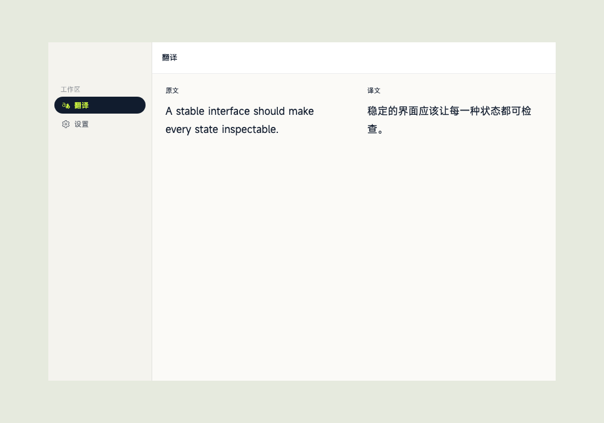

<div align="center">
  <picture>
    <source media="(prefers-color-scheme: dark)" srcset="assets/brand/linguaray/dist/readme/linguaray-readme-dark.svg">
    <source media="(prefers-color-scheme: light)" srcset="assets/brand/linguaray/dist/readme/linguaray-readme-light.svg">
    
  </picture>

  <p>隐私优先，随时通过一个快捷键开始翻译。</p>

  [](https://github.com/gong1414/linguaray/actions/workflows/ci.yml)
  [](LICENSE)
  [](https://flutter.dev/)
  [](#平台支持)

  [English](README.md) · **简体中文**
</div>

## 关于 LinguaRay

LinguaRay 是一款面向 macOS 和 Windows 的开源桌面翻译工具。选择文字、输入或
粘贴内容，或者框选屏幕区域，即可在当前工作流中完成翻译，无需来回切换浏览器。

<p align="center">
  
</p>

### 主要特点

- **一个快捷键即可使用**：打开快捷翻译窗、翻译当前选区或开始截图。
- **文字与图片翻译**：在同一套界面中处理划词、剪贴板输入和截图 OCR。
- **服务商可选**：可使用系统服务或配置兼容的翻译服务，界面不绑定单一厂商。
- **密钥安全存储**：API 密钥写入操作系统安全存储，不进入普通设置文件。
- **符合桌面习惯**：支持托盘、权限恢复、多显示器定位和平台化窗口行为。
- **界面可检查**：关键状态均可在 Widgetbook 中查看，并由 golden 测试覆盖。

## 平台支持

| 平台 | 最低版本 | 状态 |
| --- | --- | --- |
| macOS | 13.0 | 支持 |
| Windows | Windows 10 | 支持 |

Linux 暂不在当前发布矩阵中。

## 下载

构建会发布在 [Releases](https://github.com/gong1414/linguaray/releases)。首个签名
版本发布前，可以按下方步骤直接从源码运行。

> 如果维护者没有配置平台签名凭据，公开 CI 产生的构建包将不带签名。

## 从源码运行

### 环境要求

- [Flutter 3.47.1](https://docs.flutter.dev/install/archive)，内含 Dart 3.13.1
- 当前 stable [Rust 工具链](https://www.rust-lang.org/tools/install)
- macOS 需要 Xcode 与 CocoaPods；Windows 需要安装 Visual Studio 的“使用 C++ 的
  桌面开发”工作负载

```bash
git clone https://github.com/gong1414/linguaray.git
cd linguaray
dart pub get
cd apps/desktop/flutter
flutter run -d macos        # Windows 上使用 windows
```

日常界面开发直接使用 Flutter hot reload。组件目录可以独立启动：

```bash
cd apps/desktop/flutter
flutter run -d macos -t lib/widgetbook.dart
```

## 架构

LinguaRay 明确分离界面和功能能力：

```text
Flutter UI → controller → 平台服务 / UniFFI → Rust runtime
```

- `apps/desktop/flutter`：桌面宿主、路由、controller 与平台集成；
- `packages/ui_flutter`：可复用的 Flutter 设计系统；
- `packages/runtime`：通过 UniFFI 向 Dart 和 Swift 暴露 Rust runtime；
- `crates`：翻译、OCR、服务商、设置与共享核心逻辑。

更完整的边界和数据流见[架构说明](docs/ARCHITECTURE.md)，开发与测试流程见
[贡献指南](CONTRIBUTING.md)。

## 安全与隐私

LinguaRay 只会在你主动发起操作时，把内容发送给你选择的服务商。服务商密钥通过
平台安全存储保存。请勿在公开 issue 中发布密钥、隐私文本或敏感截图。

安全漏洞请按照 [SECURITY.md](SECURITY.md) 中的方式私下报告。

## 参与贡献

欢迎提交 bug、范围清晰的功能建议、文档优化和代码贡献。提交 Pull Request 前请先
阅读[贡献指南](CONTRIBUTING.md)和[行为准则](CODE_OF_CONDUCT.md)。

## 许可证

LinguaRay 采用 [MIT License](LICENSE)。
