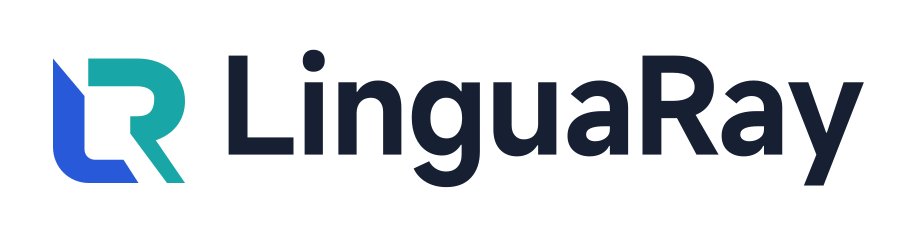

<div align="center">
  <picture>
    <source media="(prefers-color-scheme: dark)" srcset="assets/brand/linguaray/dist/readme/linguaray-readme-dark.svg">
    <source media="(prefers-color-scheme: light)" srcset="assets/brand/linguaray/dist/readme/linguaray-readme-light.svg">
    
  </picture>

  <p><strong>Translate text where you find it.</strong></p>
  <p>A privacy-minded desktop translator for macOS and Windows, built with Flutter and Rust.</p>

  [](https://github.com/gong1414/linguaray/actions/workflows/ci.yml)
  [](LICENSE)
  [](https://flutter.dev/)
  [](#platform-support)

  **English** · [简体中文](README-ZH.md)
</div>

> [!IMPORTANT]
> LinguaRay is in active pre-release development. The core workflows and
> desktop builds are tested in CI, but there is no signed stable release yet.
> For evaluation, run the application from source.

## Why LinguaRay?

Translation should be available inside the workflow you already have—not in
another browser tab. LinguaRay starts as a resident menu-bar application: it
does not open a main window at launch. Translation actions live in the native
tray menu and global shortcuts; Preferences is the only persistent window.

- **Text, selection, and screenshots** — translate typed or pasted text,
  selected text from another app, or a captured screen region with OCR.
- **Native desktop behavior** — menu-bar access, configurable shortcuts,
  permission recovery, active-display placement, and DPI-aware windows.
- **Useful immediately, configurable later** — built-in web services work
  without an API key, while a provider catalog covers traditional APIs,
  OpenAI-compatible endpoints, local servers, and model discovery.
- **Private by design** — credentials remain in operating-system secure
  storage; normal settings and UI state contain only secret references.
- **UI and runtime are separate** — Flutter renders the experience while the
  Rust runtime owns translation, OCR, providers, and persisted settings.

## Current capabilities

| Capability | Status |
| --- | --- |
| Input and clipboard translation | Implemented and covered by automated tests |
| Quick translator and selected-text workflow | Implemented; requires platform permissions where applicable |
| Screenshot capture and system OCR | Implemented for macOS and Windows |
| Global shortcuts, tray access, and window placement | Implemented |
| Provider configuration and secure credential storage | Implemented |
| Translation history, favourites, glossaries, and vocabulary | Implemented |
| Dictionary lookup and text-to-speech | Offline ECDICT is built in; Apple system translation and platform speech are available on supported macOS versions |
| Configurable input behaviour and common-language ordering | Implemented |
| Local API, URL-scheme, PopClip, SnipDo, and Raycast integration | Implemented |
| Local backup/restore, proxy modes, and verified update checks | Implemented |
| macOS and Windows desktop builds | Built and exercised by CI |
| Signed installers and stable releases | Signed draft workflow is ready; no stable release published yet |

Migration from the retired Tauri prototype and automatic replacement of
selected source text are intentionally outside the current scope. Half-finished
entry points stay hidden until they meet the same test and platform requirements
as the core workflows.

## Platform support

| Platform | Minimum version | Build status |
| --- | --- | --- |
| macOS | 13.0 | Supported in CI |
| Windows | Windows 10 | Supported in CI |

## Run from source

### Prerequisites

- [Flutter 3.47.1](https://docs.flutter.dev/install/archive) with Dart 3.13.1
- the current stable [Rust toolchain](https://www.rust-lang.org/tools/install)
- macOS: Xcode and CocoaPods
- Windows: Visual Studio with the **Desktop development with C++** workload

Confirm the desktop toolchain first:

```bash
flutter doctor
```

Then clone and run LinguaRay:

```bash
git clone https://github.com/gong1414/linguaray.git
cd linguaray
dart pub get
cd apps/desktop/flutter
flutter run -d macos        # use: flutter run -d windows on Windows
```

Flutter hot reload is the normal UI development loop. The isolated component
catalog is available through Widgetbook:

```bash
cd apps/desktop/flutter
flutter run -d macos -t lib/widgetbook.dart
```

## Architecture

```text
Flutter views
    ↓ user intent / immutable state
Riverpod view models
    ↓
Pure Dart use cases and ports
    ↓ adapters
Rust runtime (UniFFI) + typed desktop platform services
```

| Path | Responsibility |
| --- | --- |
| `apps/desktop/flutter` | Desktop host, routes, view models, adapters, and platform integration |
| `packages/application` | Pure Dart use cases, models, and ports |
| `packages/ui_flutter` | LinguaRay's Material 3 design system and test utilities |
| `packages/runtime` | Dart, Rust, and Swift UniFFI bridge |
| `crates` | Translation engines, OCR, provider configuration, and shared core logic |

Read [the architecture guide](docs/ARCHITECTURE.md) for the dependency rules,
data flow, and storage model.
Release maintainers should also read [the release guide](docs/RELEASING.md).

## Development and testing

The repository is a Dart Pub Workspace managed with Melos. Common checks run
from the repository root:

```bash
dart run melos run analyze
dart run melos run test
dart run melos run dependency_validator
cargo fmt --all -- --check
cargo clippy --locked --workspace --all-targets -- -D warnings
cargo test --locked --workspace
```

Cross-layer changes should pass the complete set. UI changes should include
Widgetbook coverage and deliberate golden updates; desktop behavior should be
verified on the affected operating system. See
[CONTRIBUTING.md](CONTRIBUTING.md) for the full workflow.

## Privacy and security

LinguaRay sends content only when you initiate a translation and only to the
provider selected for that action. Provider secrets are stored through the
operating system's secure storage. Never post API keys, private text, or
sensitive screenshots in a public issue.

Please report vulnerabilities privately by following
[SECURITY.md](SECURITY.md).

## Community

- Use [GitHub Discussions](https://github.com/gong1414/linguaray/discussions)
  for questions and design conversations.
- Use [Issues](https://github.com/gong1414/linguaray/issues) for reproducible
  bugs and focused feature proposals.
- Read [CONTRIBUTING.md](CONTRIBUTING.md) and the
  [Code of Conduct](CODE_OF_CONDUCT.md) before opening a pull request.

## License

LinguaRay is available under the [MIT License](LICENSE).
Bundled data and dependencies are documented in
[Third-party notices](THIRD_PARTY_NOTICES.md).
