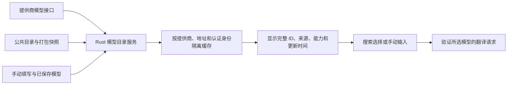

# LinguaRay 项目检测记录（2026-09-05）

检测基线：`fa398c1`，Flutter 3.47.1 / Dart 3.13.1，Rust 1.95.0，macOS。本次完成源码检查、现有测试、本地模拟接口复现、桌面冒烟与开源项目对照；业务代码未修改。

结论：项目分层和基础验证已有较好基础，能继续扩展提供商。当前最需要处理的是 LLM 流式翻译阻塞、模型 ID 完整性和模型选择体验。常规测试通过并不代表提供商翻译链路已通过验证。

**1. 验证结果**

| 项目 | 本次结果 | 边界 |
| --- | --- | --- |
| Melos analyze | 4 个包全部通过 | 静态分析 |
| Melos test | application 23、desktop 97、runtime 2、UI 39，共 161 项通过 | 含现有 widget/golden；未更新基准图 |
| Cargo test --locked --workspace | 171 项通过 | API-core 6、core 4、engine 74、runtime 86、integration 1 |
| Cargo Clippy --all-targets -D warnings | 通过 | 当前本机 Rust 工具链 |
| 统一 Dart/Rust/Swift 格式检查 | 通过 | 237 个 Dart 文件，0 个格式变化 |
| dependency_validator | 通过 | 当前脚本实际检查 desktop 包 |
| UniFFI surface check | 通过 | 已提交绑定与接口基线一致；本次未重新生成绑定 |
| macOS integration smoke | 1 项通过 | 常驻启动、快捷键注册、权限读取、朗读、ECDICT、快捷窗口、所有设置路由 |
| 本地协议探针 | 1 项目录统计通过，2 项行为断言失败 | 成功响应无法进入运行时回调；中文跨分包损坏 |
| Python 目录生成探针 | 已复现 ID 前缀丢失 | 使用本地嵌套 TOML fixture |
| Dart 翻译编排探针 | 已复现前置检测阻塞 | 已指定源/目标语言仍等待检测完成 |

桌面冒烟首次因测试目录选在应用沙盒外而失败，改为沙盒内独立目录后通过。这是测试环境配置问题，不计为产品缺陷。冒烟后重新构建正常 macOS Debug 应用，避免留下测试入口。

尚未验证：真实付费提供商的账户权限、配额、模型翻译质量与网络可达性；Windows 本机行为；需要交互授权的实际选区/截屏；真实系统翻译下载语言包。Windows 项目已有 CI 矩阵，本次未读取其运行结果，不能声称 Windows 已通过。

**2. 优先修复的问题**

**F01 · P1 · LLM 流式翻译会阻塞，已有完整运行时复现。**

[llm_api.rs](/Users/daoyu/Code/projects/islandpot/packages/runtime/rust/src/runtime/llm_api.rs:284) 在异步函数里调用同步 `receiver.rx.recv()`；[support.rs](/Users/daoyu/Code/projects/islandpot/packages/runtime/rust/src/runtime/support.rs:95) 把该函数放在单线程 Tokio runtime 中，而提供商用 `tokio::spawn` 在同一运行时读取网络流。同步等待阻止读取任务执行。

探针调用真实 `Runtime.llm().translate_stream()`，本地 HTTP 接口返回完整的成功 SSE，3 秒内没有任何回调；直接测试 engine 的网络流可以收到响应。不是凭超时猜测网络错误，代码中的调度依赖与复现一致。相同桥接路径用于三个 LLM 协议适配器。

建议：改成异步 channel/异步读取，或将同步接收移出异步执行线程；同时补从本地接口一直到 UniFFI 回调的测试。保留公有接口时也可以先在内部修复，不必重写桌面架构。

**F02 · P1 · 离线模型目录生成时丢失完整模型 ID。**

[update_provider_catalog.py](/Users/daoyu/Code/projects/islandpot/scripts/update_provider_catalog.py:137) 对递归找到的文件使用 `path.stem`。例如 `providers/openrouter/models/anthropic/claude-test.toml` 生成 `claude-test`，而应保留 `anthropic/claude-test`。

本地 fixture 已复现；项目锁定的 [models.dev 上游目录](https://github.com/anomalyco/models.dev/tree/08324a024a9de60e507e08779f6667fbf8a25001/providers/openrouter/models) 确实采用厂商子目录。本地 OpenRouter、SiliconFlow、Groq 等快照可见没有命名空间的条目。选择这些条目可能得到不存在的模型 ID，不能作为可靠兜底。

建议：保留相对模型目录的完整路径，核对上游 ID 规则后重建快照；增加带斜杠 ID、同名不同厂商、大小写和真实固定上游样例的测试。不要只修正列表展示名。

**F03 · P2 · 中文流式内容跨 HTTP 分包时会损坏。**

[openai_compatible.rs](/Users/daoyu/Code/projects/islandpot/crates/engine/src/provider/llm/openai_compatible.rs:378) 对每个网络块单独 `String::from_utf8_lossy`。Anthropic、Ollama 也有相同写法。UTF-8 字符不保证与网络块边界对齐。

实际将“你”的第一个字节与其余字节分开发送，收到的内容是 `���好`，预期 `你好`。已实测 OpenAI-compatible 适配器，其余两种为相同代码模式的风险。

建议：先累积原始字节，再按完整 SSE/NDJSON 记录解码；建立共享解析组件，覆盖中文、emoji、CRLF、无空格 data 字段、异常事件和异常结束。

**F04 · P2 · 流式结束状态处理不完整，界面可能掩盖部分失败。**

[llm_api.rs](/Users/daoyu/Code/projects/islandpot/packages/runtime/rust/src/runtime/llm_api.rs:286) 遇到 `finish_reason` 时先结束，没有转发同一块中的非空正文；channel 关闭则直接视为正常 stop。达到长度上限的结束原因虽进入 Dart，但 [RuntimeTranslationRepository](/Users/daoyu/Code/projects/islandpot/apps/desktop/flutter/lib/src/data/runtime_translation_repository.dart:141) 只保留文本，应用层会把非空结果标为完成。

[QuickTranslateResultPanel](/Users/daoyu/Code/projects/islandpot/apps/desktop/flutter/lib/src/ui/quick_translate/widgets/quick_translate_result_panel.dart:95) 又优先显示非空正文，只在没有正文时进入失败提示。已有部分文字后发生错误，用户可能只看到译文，没有明确的失败/重试提示。

这是源码确认的边界缺陷，尚未逐项做 UI 端到端复现，且当前会先受 F01 阻塞。建议先发正文再处理终止，把正常结束、截断、异常断流、取消区分开；正文与错误提示应能同时显示。

**F05 · P2 · 模型获取结果只展示前 16 项。**

[ProviderEditorView](/Users/daoyu/Code/projects/islandpot/apps/desktop/flutter/lib/src/ui/settings/views/providers_settings_view.dart:384) 固定使用 `widget.models.take(16)`，没有搜索或“查看全部”。目录已包含 OpenRouter 359 项、OpenAI 36 项，接口的完整返回对用户实际上不可选；同时在线结果按 ID 排序，前 16 项不等于适合翻译的模型。

建议：可搜索的完整列表，保留手动输入，支持当前模型、最近使用和来源标记；按文本输出与协议兼容能力筛选，未知能力标为待验证。

**F06 · P2 · 在线获取失败会静默变成离线目录。**

[RuntimeProviderSettingsAdapter](/Users/daoyu/Code/projects/islandpot/apps/desktop/flutter/lib/src/data/workspace_settings/provider_settings_adapter.dart:206) 捕获所有错误后直接返回快照，包括认证失败和网络失败。界面只有字符串列表，无法知道返回的是在线可用模型还是离线候选。成功后又把 live 与 snapshot 合并，同样没有标注账户可用性。

建议返回结构化结果：模型、来源、更新时间、是否过期、错误类别。401/403 应提示密钥/权限问题；离线列表可以继续提供，但应标注“未验证”，不要显示成接口获取成功。连接测试与选定模型的小型翻译测试也应分别呈现。

**F07 · P2 · 修改 Base URL 后可能仍从旧地址获取模型；切换提供商也有旧结果残留。**

[catalog.rs](/Users/daoyu/Code/projects/islandpot/packages/runtime/rust/src/catalog.rs:95) 会输出根据预设推导出的 models URL，[providerPresetInitialFields](/Users/daoyu/Code/projects/islandpot/apps/desktop/flutter/lib/src/routes/settings/provider_catalog.dart:46) 再把它写为显式 `modelsUrl`。只改 Base URL 时，这个旧值不会更新；[URL 规则](/Users/daoyu/Code/projects/islandpot/crates/engine/src/catalog/urls.rs:74) 优先使用显式 models URL，导致翻译端点和获取模型端点不一致。

[ProviderEditorDialog](/Users/daoyu/Code/projects/islandpot/apps/desktop/flutter/lib/src/ui/settings/service_settings_screens.dart:307) 在异步获取完成时只检查 mounted，没有检查提供商/地址/密钥是否已改变；切换类型时也没有清空模型结果。

建议：区分“自动推导地址”和“用户显式覆盖地址”；按配置版本隔离请求，切换时清空旧结果并丢弃过期返回。

**F08 · P2 · 不必要的语言检测阻塞所有翻译，缺少超时与完整取消链路。**

[TranslateText](/Users/daoyu/Code/projects/islandpot/packages/application/lib/src/translation/translate_text.dart:32) 在发布任何结果前，固定等待第一个服务检测语言，即使用户已选择 `en → zh-Hans`。本地 Dart 探针中，检测 pending 时实际翻译调用 0 次、UI 结果事件 0 次；检测完成后才开始翻译。

[HTTP transport](/Users/daoyu/Code/projects/islandpot/crates/engine/src/common/transport.rs:45) 没有统一连接/请求超时；OpenAI-compatible 获取模型单独有 15 秒超时，但普通翻译与 Anthropic/Ollama 路径没有同等保障。[LlmStream](/Users/daoyu/Code/projects/islandpot/apps/desktop/flutter/lib/src/services/llm_stream.dart:32) 没有把订阅取消传回 Rust。前端使用 requestId 忽略旧结果，只解决显示覆盖，不能结束旧网络请求。

建议：显式源语言时跳过检测；自动检测设置短超时并可降级；建立取消句柄与超时策略；并发比较服务时限制并发数量。当前全部启用服务都会发起翻译，应让用户明确选择“单服务”或“多服务比较”。

**3. 提供商现状及扩展方向**

运行时实际列出 35 个预设，其中 20 个具有 LLM 能力：

| 类别 | 已有预设 |
| --- | --- |
| 云端官方，10 个 | OpenAI、Anthropic、Gemini、DeepSeek、百炼 Qwen、智谱、Moonshot Kimi、豆包 Ark、xAI、Groq |
| 聚合平台，4 个 | OpenRouter、SiliconFlow 中国区、SiliconFlow Global、ModelScope |
| 本地/自部署，6 个 | Ollama、LM Studio、LocalAI、vLLM、llama.cpp、LiteLLM |

这里的“已有”表示目录和适配代码存在，不表示已用真实账户逐一验证。Gemini 当前走兼容接口；核心只有 Chat Completions、Anthropic Messages、Ollama 三类 LLM 适配路径。

扩展建议按协议成本分层：

| 优先级 | 建议 | 实施边界 |
| --- | --- | --- |
| 第一批 | 增加明确的“自定义 OpenAI-compatible”入口；MiniMax、StepFun、Mistral、Together AI、Fireworks | 当前有通用引擎，但目录缺少直观的通用预设入口；候选已有兼容 API，仍需验证参数、错误和模型发现差异 |
| 第二批 | DeepInfra、Cerebras、NVIDIA 等 | 作为候选加入协议验证矩阵，不仅添加品牌名称；OpenCode 官方目录可作入口参考 |
| 独立专项 | Responses、原生 Gemini、Azure、Bedrock、Vertex | 涉及不同协议、区域、部署名或鉴权，不能只换 Base URL |
| 后置 | 第三方编码订阅/OAuth、各类中转平台 | 根据实际翻译需求决定，不因其他工具支持就默认适用 |

第一批选择是基于接入路径的工程判断，未进行翻译质量排名。官方依据：[MiniMax](https://platform.minimax.io/docs/api-reference/api-overview)、[StepFun 模型接口](https://platform.stepfun.ai/docs/en/api-reference/models/list)、[Mistral 迁移说明](https://docs.mistral.ai/resources/migration-guides)、[Together](https://docs.together.ai/docs/inference/openai-compatibility)、[Fireworks](https://docs.fireworks.ai/tools-sdks/openai-compatibility)。

**4. 自动获取模型应怎样实现**

现有链路已经是“按钮触发在线获取 + models.dev 离线快照 + 手动模型 ID”。[生成脚本](/Users/daoyu/Code/projects/islandpot/scripts/update_provider_catalog.py:1) 明确规定 models.dev 仅开发期更新，应用不会在运行时拉取公共目录；这是一项现有策略，不应误报为缺陷。

CC Switch 的 [自动获取模型说明](https://github.com/farion1231/cc-switch/blob/main/docs/user-manual/en/2-providers/2.1-add.md#auto-fetch-models) 描述了带凭证请求模型端点、列表选择和分类错误。[模型命令源码](https://github.com/farion1231/cc-switch/blob/main/src-tauri/src/commands/model_fetch.rs) 也保留协议格式、显式模型地址和请求头参数。可借鉴其配置体验与诊断信息。

OpenCode 的 [提供商文档](https://opencode.ai/docs/providers/) 描述 AI SDK、公共模型目录与多提供商支持；当前 [models-dev 源码](https://github.com/anomalyco/opencode/blob/dev/packages/core/src/models-dev.ts) 具有磁盘缓存、打包快照、刷新和原子写入，默认公共数据源已是 models.opencode.ai。其 [provider 源码](https://github.com/anomalyco/opencode/blob/dev/packages/opencode/src/provider/provider.ts) 包含多协议适配和部分提供商的模型发现。不能把它简化成“所有厂商统一请求 /v1/models”。

建议 LinguaRay 的模型链路仍由 Rust 负责：

建议的行为：

- 打开模型选择器时先显示缓存；配置完整后异步刷新，保留“刷新”按钮。
- 在线接口用于发现该端点返回的模型，公共目录用于补充名称/能力；目录存在不等于账户有调用权限。
- 缓存按 provider instance、Base URL、协议和认证身份版本隔离，不保存原始密钥。
- 公共目录的自动更新先做发布期 CI；运行期更新作为明确的新网络策略，支持关闭、过期缓存和失败恢复。
- 不自动更换用户已保存的默认模型，不自动下载 Ollama 权重。
- 补充文本输出、协议、上下文/输出上限、参数支持信息。目前 FFI 的 `CatalogModelChoice` 只有 ID/name，后续只剩字符串，无法支持这些判断。
- 新模型的参数适配需要单独验证。当前翻译固定发 `temperature=0.3`、`max_tokens=4096`，模型目录扩展本身不会解决协议或参数不兼容。

**5. 功能界面的改进重点**

已人工查看常规设置、翻译服务、长结果快捷翻译的现有 golden 图，并由本次测试验证这些基准没有变化。它们是受控 fixture 截图，不代表所有真实账户状态。当前 Material 3 视觉基础可以保留，优先调整信息和操作路径。

| 当前体验 | 建议 |
| --- | --- |
| “配置提供商”是服务页中的入口，提供商与服务关系需要用户理解 | 增加清晰的“AI 提供商”入口；配置成功后能直接创建/启用翻译服务 |
| 预设选择已有搜索，但模型选择只有前 16 个 chip | 模型使用完整可搜索列表，支持键盘操作、长 ID 和最近使用 |
| 提供商列表显示引擎 typeId 与“已保存密钥” | 显示用户可识别的名称、端点、默认模型、最近验证状态；“保存密钥”不代表“连接可用” |
| ID、类型、Key、模型混合在一个表单 | 名称 → 凭证 → 模型 → 验证；内部 ID 自动生成并收进高级设置 |
| 测试连接只调用 LLM 的模型列表 | 分别显示“凭证/模型列表正常”和“所选模型翻译正常”，错误给出具体可操作提示 |
| 快捷翻译只在多个结果时显示服务切换，模型不可见 | 在结果附近提供简洁的服务/模型标识和单服务重试；支持真正取消 |
| 有部分正文后错误提示可能消失 | 保留已收到正文，并明确显示“未完成/已截断/失败”，允许重试 |
| 新能力增加后对话框与侧栏容易拥挤 | 小屏、放大字体、长模型名称、多账号、离线/过期/401/429 状态加入 Widgetbook 和 golden |

不建议为这些优化增加第二个引导窗口，或者改变现有常驻托盘与动态快捷窗口的产品形态。

**6. 代码优化与建议实施顺序**

现有 application ports、RuntimeSettings 门面、Rust 提供商目录、凭证安全存储和行为基线值得保留。主要优化应围绕可验证的行为，而不是再次大规模拆文件。

1. **可靠性修复。** 先修 F01—F04；补从实际 HTTP 分包到 Runtime 回调的测试，验证结束语义和中文完整性。
2. **模型配置闭环。** 修 F05—F07，修正目录生成器并重建快照；引入有来源的模型结果和可搜索列表；加入选定模型的翻译验证。
3. **响应速度与取消。** 修 F08，补检测降级、连接/读取超时和取消传播；采用共享异步运行时，减少逐请求创建线程的开销。
4. **扩展协议与预设。** 新平台先声明协议/鉴权/模型发现方式，逐个通过本地协议测试和受控账户测试；保持 Rust 负责业务。
5. **小规模维护优化。** 用标准 TOML 解析器替代当前手写简化解析；把约 200 KB 快照做 OnceLock 缓存，避免每次查询重新解析；模型去重使用有序集合；在有测量证据时再合并流式 UI 更新频率。
6. **独立依赖迁移。** 当前 resolver 提示 67 项存在约束外新版本，这不是 67 个漏洞。按工具链分组升级；把 uniffi-dart 的 moving main 改成显式固定 revision，现有 Cargo.lock 已固定本次构建的提交。不要与行为修复混合。

每阶段验收都应保留现有 332 项常规测试，新增真实协议边界测试；UI 变化补 Widgetbook/golden；跨层修改重新生成并验证 UniFFI；macOS/Windows 分别执行构建和桌面冒烟。

本次证据与复现代码保存在 [附件目录](/Users/daoyu/Code/projects/islandpot/docs/audits/2026-09-05)，修复实施尚未开始。
