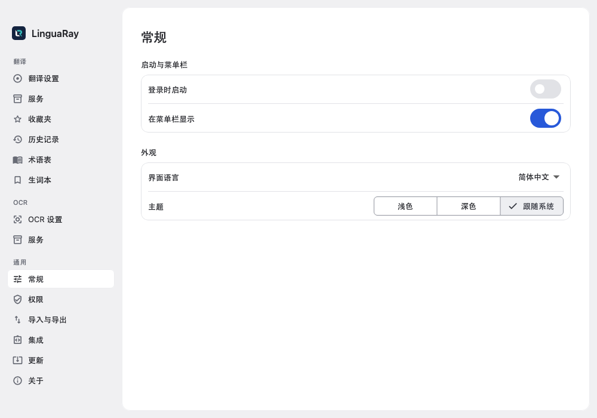
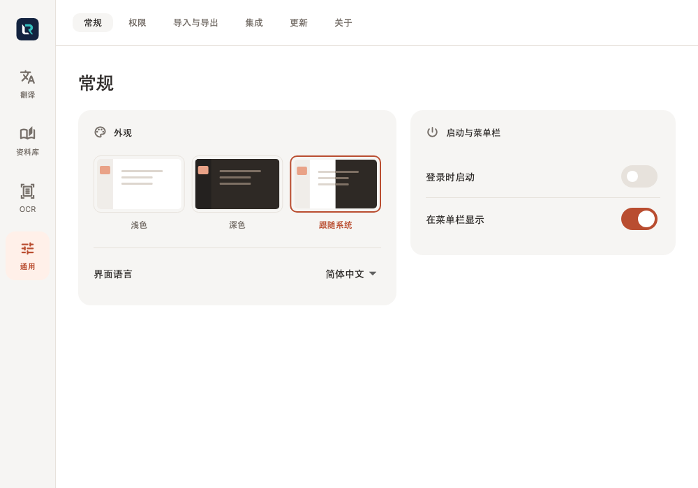
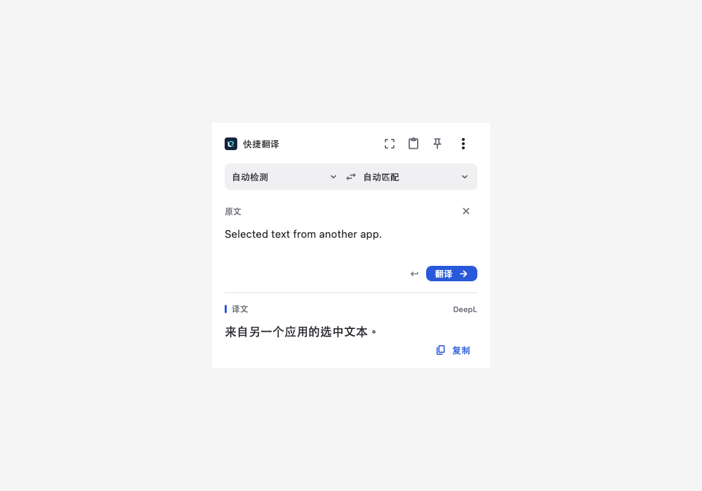
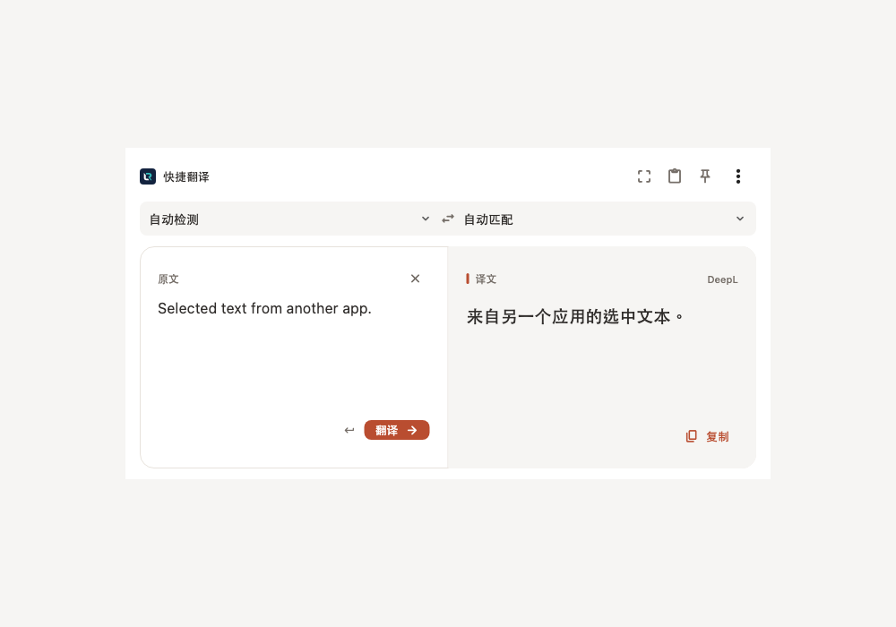

# 界面改前与改后

以下为相同视图与状态的 Flutter 实际渲染图。改前为 99e725f，改后为当前实现。固定字体用于视觉回归；原生系统字体另在 macOS 应用内检查。

## 设置

| 改前：完整长侧栏、通栏配置行 | 改后：四个工作区、顶部分类、并列外观与启动设置 |
| --- | --- |
|  |  |

## 快捷翻译

| 改前：396 px 上下阅读 | 改后：720 px 原译文双栏 |
| --- | --- |
|  |  |

宽度小于 600 px 时，新版仍可上下排列；低高度窗口可滚动到操作按钮。

