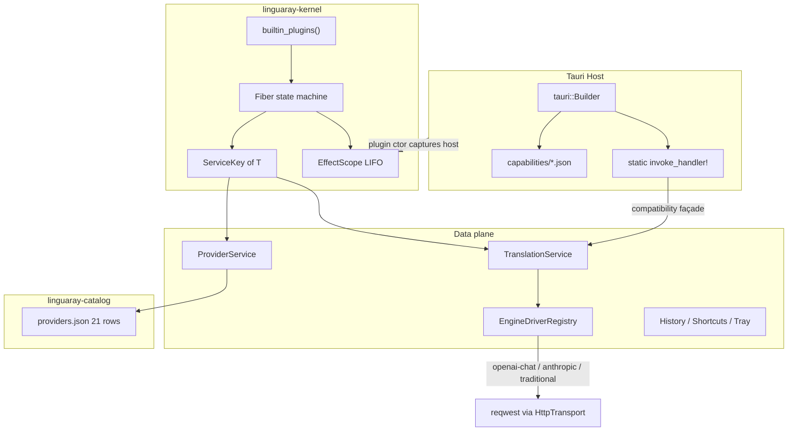
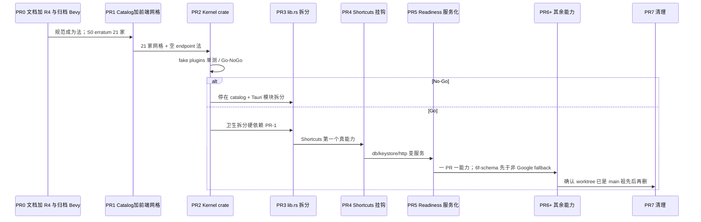

# LinguaRay 插件内核设计（thin core + everything-is-a-plugin）

| 字段 | 值 |
|---|---|
| **Title** | LinguaRay Plugin Core — 薄内核 + 一切皆插件 |
| **Author** | LinguaRay architecture |
| **Date** | 2026-08-14 |
| **Status** | **Frozen rev-4**（产品选择已落成 Decision；内核确定性 / 原子发布 / lease-drain / 同源凭据已立法。未授权写实施计划，直到本 rev 被接受） |
| **Identifier** | `io.github.gong1414.linguaray` |
| **Product version** | 0.1.0 |
| **Language** | 正文中文；标识符 / 路径 / crate 名保持英文 |
| **Supersedes** | [`docs/superpowers/archive/2026-08-14-linguaray-bevy-plugin-core-redesign.md`](../archive/2026-08-14-linguaray-bevy-plugin-core-redesign.md)（Bevy rev-1 与 Cordis/Bevy rev-2；已归档） |
| **Canonical path** | `docs/superpowers/specs/2026-08-14-linguaray-plugin-core-design.md` |

---

## 0. 文件名与文档地位

先前两份内核草案共用路径 `docs/superpowers/specs/2026-08-14-linguaray-bevy-plugin-core-redesign.md`，是为了保住评审链接。该文件名把 **Bevy** 写进了规范身份，已经错误。

| 角色 | 路径 | 处置 |
|---|---|---|
| **本文（内核法）** | `docs/superpowers/specs/2026-08-14-linguaray-plugin-core-design.md` | Frozen rev-4。开放问题已关闭 |
| **被取代的 Bevy/Cordis 草案** | `docs/superpowers/archive/2026-08-14-linguaray-bevy-plugin-core-redesign.md` | 已归档；文首 `SUPERSEDED`。禁止再引用 `specs/…bevy…` |
| **产品法（仍有效）** | `docs/superpowers/specs/2026-08-01-linguaray-product-baseline.md` | 保留。PR-0 必须写入两条 erratum：（1）「v1 无插件系统」对 **官方内核插件** 失效，第三方 / WASM / Bob·Pot 兼容仍是 🔜；（2）官方 AI catalog 由 S0 的 8 家变为本文 §7.3 的 **21 个 id**；30+ 长尾仍是 🔜。**不拆成 8+13。** |
| **设计 token 法** | `docs/superpowers/specs/2026-08-08-rayline-r0-freeze-decision.md` | 保留，本文不改 UI |

开源贡献叙事必须是：

> **加一个供应商 = 给 catalog 提一行 JSON + 发版重编译。加一项能力 = 加一个插件 crate / 模块 + 组合清单里的一行。**

「发版重编译」是故意的：catalog 用 `include_str!` 编进二进制，**不读用户可写路径**。贡献者不改 Rust match，不重启 Fiber，也不手改 `ProviderCenter.tsx` 的硬编码网格。

不是「读 Cordis 论文」。不是「改 4134 行的 `src-tauri/src/lib.rs`」。

---

## 1. Overview

LinguaRay 是 Tauri 2 + Rust + SolidJS 的菜单栏/托盘翻译工具。今天的主进程把 42 个 IPC 命令、setup、迁移、热键、托盘、翻译编排全部堆在 `src-tauri/src/lib.rs`（4134 行，`generate_handler!` 约第 3738 行）。AI 供应商目录硬编码在 `src-tauri/src/providers.rs` 的 4 个 `ProviderPreset` 字面量里；`src-tauri/src/db/providers.rs` 的 `preset_protocol()` 再按 id 做 match，未知 id 一律变成 `Protocol::CustomHttp`。这就是「加一个 Groq 要动代码、加一个 OCR 要再胀 `lib.rs`」的根因。

本文给出第一性原理的替代架构：**薄内核 + 两个永不混用的扩展面**。

1. **内核**（`src-tauri/crates/linguaray-kernel`，纯 Rust，无 Tauri 依赖）只做五件事：组合插件、提供类型化服务槽、追踪可逆宿主副作用、配合静态 Tauri 权限、拥有进程生命周期。内核不翻译、不列供应商、不做 OCR/TTS、不画托盘菜单、不拥有历史 schema。领域 trait 与 `ServiceKey` 常量住在 `src-tauri/crates/linguaray-contracts`（§5.2）。
2. **代码插件**（v1 全部 in-tree、受信任、编译进去）：Capability 插件（History / Shortcuts / Selection / Tray …）与 Driver 插件（**一个** `openai-chat` + `anthropic` + 一个 `traditional-engines`）。加 OCR = 新模块 + 组合清单一行。**生产 `builtin_plugins()` 在 K0 Go 之前不得激活 stub Fiber。**
3. **数据目录**（`src-tauri/crates/linguaray-catalog/providers.json`，带 `schema_version`）：供应商预设。加 Groq = 一行 JSON + 发版重编译。改 DeepSeek 默认模型 **不改 Rust match、不重启 Fiber、不读可写 catalog**；因为 `include_str!`，发版仍会重编译二进制。

v1 必须一次发齐全部 21 个 AI 预设（见 §7；这是对 S0「8 家 AI」的产品法修订，PR-0 erratum，**不拆 8+13**），外加传统引擎槽位（Google 已实现；DeepL / Microsoft / 百度 / 有道 / 腾讯按同一 Driver 面补齐，**非 Google 不得在 `PR-6f-schema` 之前进入 fallback 选择器**）。第三方 dylib / npm / 主进程加载不可信代码是明确非目标；`PluginDescriptor` 预留稳定 id / manifest / capability 契约作为未来 WASM（Extism / wasmtime）接缝。

R4–R7 产品工作 **不以内核完成作为前置**。第一个用户可见 PR 是 **catalog + Provider Center 前端**（今日网格硬编码 4 家，`list_engines` 前端不用）。没有前端的后端-only catalog PR **不得**自称用户可见。

---

## 2. Background & Motivation

### 2.1 当前事实（已对照源码，非臆造）

| 事实 | 位置 |
|---|---|
| 产品身份 | Tauri 2 + Rust + SolidJS；`io.github.gong1414.linguaray`；`0.1.0`；`package.json` license = MIT |
| 巨石入口 | `src-tauri/src/lib.rs` 4134 行。文件头仍写着 *「No WASM, no plugin system in v1」* — 该句被本文覆盖 |
| IPC 表面 | `generate_handler!`（约 L3738）注册 **42** 个命令：`translate*`、`list_engines`、keystore、settings、`provider_*`、`shortcut_*`、`history_*`、`a11y_status`、`archive_database`、`open_settings_window` |
| 权限 | `src-tauri/capabilities/{main,popup,input}.json` 静态授权。CSP 写死在 `src-tauri/tauri.conf.json` |
| AI 预设 | `providers::presets()` 只有 `openai` / `anthropic` / `gemini` / `ollama`。端点是 **完整 URL**（Gemini 用 `/v1beta/openai/chat/completions`，这是故意的） |
| 线协议 | `wire::ApiKind` 只有 `OpenAIChat \| Anthropic`。`wire::call` 对前者 `bearer_auth`，对后者 `x-api-key` + `anthropic-version: 2023-06-01` |
| DB 协议 | `db::providers::Protocol` = `OpenaiChat \| Anthropic \| Gemini \| GoogleTranslate \| CustomHttp`。schema CHECK 与之对齐 |
| 加供应商的真实痛点 | `preset_protocol()`（`db/providers.rs` L352）按 **四个 id** match；其余全部 `CustomHttp`。`adapter::protocol_to_api_kind` 把 `Gemini` 再折回 `OpenAIChat` |
| 模型列表 | `provider_get_models` 目前只返回 profile.model + preset.default_model，注释写明完整 `/models` 拉取是 S3 |
| 传统引擎 | `engines::TraditionalEngine` trait；`registry()` 只有 `engines/google.rs`（`translate.google.com/translate_a/single?client=gtx`）。`TRADITIONAL_TEMPLATES` 已列出 `google/deepl/microsoft/baidu/youdao/tencent`，但实现与 fallback 校验目前只认 `Protocol::GoogleTranslate` |
| 编排 | `service::translate` / `translate_with_fallback_ref` / `translate_parallel`。不变量：latest-wins（`Session.gen: GenerationToken`）、local-sacred（`is_local` 看 loopback host）、B5 输入序、B6 session 级至多一次 fallback、classified fallback（`Error::FallbackEligible` vs `Config` vs `Keystore` vs `LocalNoFallback`） |
| 适配器 | `adapter::profile_to_preset`：`preset.id = profile.secret_ref`（keystore 查找键，**不是** uuid） |
| 就绪 | `DataReadiness::{Ready, NeedsKeystoreRecovery, NeedsDatabaseRecovery, MigrationIncomplete}` 存在 `AppState.readiness`。命令经 `require_ready_gated` / `require_ready_gated_write` + `data_gate` |
| 热键 | `ShortcutController` + `Registrar::replace_all` + `revision` / conflict / rollback。`TauriShortcutRegistrar` 失败时逆序恢复旧绑定 |
| 历史 | `history::persist_translation_session`：显式 consent、加密、keystore 缺钥 fail-closed。`history/crypto.rs` 是 History 内部实现，**不是插件** |
| 剪贴板 | `clipboard::fsm` 平台无关状态机 + Windows 复合写。`selection.rs` 把它接到 AX / sentinel-copy |
| 托盘 | `tray_state::TrayStateController` 同步 `parking_lot::Mutex`，`TranslationGuard` RAII，不走 Web |
| 前端 | Rayline 在 `packages/ui` + `apps/ui-lab`。设计 token 冻结于 R0 文档 |
| Provider Center 网格 | `src/features/settings/ProviderCenter.tsx` 的 `PRESETS` **硬编码 4 家**（L97–102）。`handleAddPreset` 读该常量，不读 IPC。`test/ProviderCenter.test.tsx` 锁「only the 4 supported AI presets」。`test/App.test.tsx` 断言前端命令列表 **不得** 含 `list_engines` |
| 空 endpoint create | 已知预设走 `validate_endpoint(final)`（`db/providers.rs` L381–390）；`validate_endpoint("")` 解析失败。未知 template（今日的 `custom`）才允许空 endpoint（L394–401）。前端 `validateEndpoint("")` → `endpoint-required`（`provider-domain.ts` L271–273） |
| HTTP client | 全进程 **一个** hardened `reqwest::Client`（`lib.rs` `build_http_client` L1193–1199：`redirect(Policy::none())`、30s/10s）。Ollama 也走它 |
| Cargo | **无** 仓库根 `[workspace]`。唯一 package 是 `src-tauri/`（`linguaray` 0.1.0，lib `linguaray_lib`） |
| `0.0.0.0` | `endpoint_is_local` / `service::is_local` 视 `0.0.0.0` 为 local；`validate_endpoint` 与 TS `validateEndpoint` **不允许** `http://0.0.0.0`。本设计 **保持** 这一分裂，catalog PR 不得「顺便修」 |
| 产品目录（S0 冻结 8 AI + 6 传统） | AI：OpenAI / Anthropic / Gemini / DeepSeek / OpenRouter / Azure OpenAI / Ollama / Custom；传统：Google / DeepL / Microsoft / 百度 / 有道 / 腾讯。S0 另标「30+ service count」为 post-baseline。**本文把官方 AI catalog 修订为 21 id**（PR-0 erratum），不是「补上滞后的 4 家」 |

### 2.2 痛点

1. **能力扩张路径是改巨石。** History / OCR / TTS / External API / Updater 都会再往 `lib.rs` 加命令、setup 和状态。
2. **供应商扩张路径是改 match。** `preset_protocol()` 把「目录数据」伪装成「代码分支」。DeepSeek 在 S0 里是必发项，在实现里却会变成 `CustomHttp`。
3. **副作用没有逆操作。** 热键、托盘、窗口监听、后台任务的注册/注销分散；Shortcuts 已经自建 revision/rollback，其他能力没有同等纪律。
4. **就绪状态是手工聚合。** `AppState` + `Session` + `DataReadiness` 三套所有权。keystore 损坏时 History / Provider key / External API 的停用靠人记得去闸。
5. **先前草案走偏。** Bevy 把桌面应用塞进 ECS/`App`（`!Send + !Sync`）；Cordis rev-2 把 Fiber/YAML/HMR/realm 带得太远，且把 Provider 行误当成插件。

### 2.3 用户对本轮的覆盖

先前评审「先别做插件内核」已被用户从第一性原理覆盖。产品范围不变：**翻译工具，不是聊天应用**。S0 的第三方插件 SDK / Bob·Pot 兼容仍是 🔜。变的是官方能力与官方驱动必须是插件，内核必须薄到「加能力不改 `lib.rs` 业务」。

---

## 3. Goals & Non-Goals

### 3.1 Goals

- 内核零翻译、零供应商列表、零 OCR/TTS、零托盘菜单项、零历史 schema。领域 trait 不进 kernel。
- 用户可见能力全部是插件；协议是 Driver 插件；供应商预设是数据。
- v1 一次发齐 21 个 AI 预设（§7）。仅 `ready` 声称 fill-key-and-use；`setup_required` / `unverified` 必须在 UI 标明。
- 加供应商 = catalog JSON + 发版重编译 + Provider Center 经 IPC 读同一份数据；加能力 = 新模块 + `builtin_plugins()` 一行 +（若有 IPC）`.plugin(foo::host_plugin())` 一行。
- v1 插件受信任、in-tree、静态链接。命令继续 `invoke_handler!` 编译期可审计。
- 控制面（enable/disable/readiness/dispose）可按插件串行；数据面（HTTP / 模型拉取 / DB）留在 Tokio + `spawn_blocking`。
- 不回归 §13 列出的产品不变量。
- 渐进 strangler：禁止一次性重写 `lib.rs`。R4–R7 不被内核阻塞。
- 仓库在新设计落地后清理过时草案 / 已合并 worktree；不删仍有效的产品决策。

### 3.2 Non-Goals（本波明确不做）

- dylib / npm / 主进程加载第三方代码。
- YAML 插件树、HMR、realm、字符串事件总线、waterfall 作为默认。
- Bevy `App` / ECS / 第二套 frame loop。
- 把每个 ProviderProfile 或每个 vendor 做成插件。
- 把 `history/crypto.rs`、wire 编码器、纯函数做成插件。
- 复制 cc-switch 的 Codex OAuth 反代、Claude Desktop role mapping、Responses 本地网关、中转站长尾（PackyCode、Cubence…）。Custom 覆盖这些用户。
- 引入 `async-openai` / `ollama-rs` 等聊天 SDK。
- 远程签名 catalog overlay（schema 预留，本波不实现）。
- 一次性重命名全部 IPC。
- 改变产品身份为聊天 / 解释 / 语法 / 闪卡。

---

## 4. First Principles（架构必须编码的七条）

### P0 — 内核不翻译

Core 只：组合插件、提供类型化服务槽、追踪可逆宿主副作用、配合静态 Tauri 权限、拥有进程生命周期。`src-tauri/crates/linguaray-kernel` **禁止** 依赖 `reqwest` 业务调用、`rusqlite` schema、任何 vendor 字符串、任何领域 trait（`TranslationService` 等）。领域类型住在 `linguaray-contracts`。

### P1 — 插件是可替换能力，不是文件，也不是 vendor 行

| 是插件 | 不是插件 |
|---|---|
| `openai-chat` 协议 Driver（代码） | `ProviderProfile` 一行 |
| History / Shortcuts / Selection / Tray / OCR Capability | `history/crypto.rs` |
| 一个可独立停用的宿主能力 | DeepSeek（这是 catalog 数据） |
| | `wire.rs` 里的 JSON 拼装函数（Driver 内部） |

### P2 — 两个扩展面，永不混用

1. **代码插件**（v1 编译进去）：Capability + Driver。加 OCR = 新 crate/模块 + 组合清单一行。
2. **数据目录**（JSON，带版本）：供应商预设。加 Groq = 一行 JSON + 发版重编译。不改 Rust match，不重启 Fiber，不读用户可写 catalog。

### P3 — v1 插件受信任且 in-tree

无 dylib、无 npm、无不可信代码进主进程。第三方 / WASM（Extism / wasmtime）是 `PluginDescriptor` 上的 **未来接缝**（稳定 id、manifest、capability 契约），本波非目标。严肃开源内核的做法：官方插件 in-tree + 社区用数据 PR 加供应商。

### P4 — Host vs domain 继续分裂

- **Tauri Host Plugin**（`tauri::plugin::Builder`）：静态 `invoke_handler!`、permissions、setup、on_event、on_drop。命令编译期可审计。
- **Domain plugin**：activate / deactivate、provide services、install effects。

一个能力可以同时交两半。前端 IPC 名按域迁移；保留兼容 façade，禁止一个 PR 改完所有命令名。

### P5 — 控制面 ≠ 数据面

生命周期（enable/disable/readiness/effect dispose）可以按插件串行。翻译 HTTP、模型拉取、DB 查询留在 Tauri/Tokio 与 `spawn_blocking`。禁止全局单线程调度器。禁止 Bevy `App`。

### P6 — 只取 Cordis 里便宜的语义，丢掉其余

**KEEP：** 可逆 effect（LIFO async dispose）、required/optional 服务依赖、activation epoch（迟到的 completion 不得写入新 activation）、显式组合清单。

**DROP：** YAML 插件树、HMR、realm、字符串事件总线、waterfall-as-default、Bevy ECS、把每个 Provider 当插件。

### P7 — 保住现有产品不变量

latest-wins generation token、local-sacred、classified fallback（B5/B6）、keystore fail-closed、provider 乐观锁 + consent、history 显式 consent/加密、shortcut revision/rollback、popup sizing、`DataReadiness` fail-closed、静态 CSP + 每窗口 capabilities。

---

## 5. Proposed Design

### 5.1 分层

```text
┌─ Tauri Host ──────────────────────────────────────────────────────────┐
│ OS event loop · WebView · IPC · capabilities · main-thread APIs       │
│ Builder                                                               │
│   .plugin(linguaray_kernel_host::plugin())   // 诊断 / shutdown 钩子    │
│   .plugin(shortcuts::host_plugin())                                   │
│   .plugin(providers::host_plugin())                                   │
│   .plugin(history::host_plugin()) ...                                 │
│ 兼容 façade：现有 42 个无命名空间命令暂时仍由 application invoke_handler  │
└──────────────────────────────┬────────────────────────────────────────┘
                               │ 插件构造函数捕获的宿主适配器（热键 / 窗 / 托盘）
                               ▼
┌─ linguaray-kernel（控制面，无 Tauri dep）──────────────────────────────┐
│ builtin_plugins() 显式清单                                             │
│ Fiber: Disabled/Pending/Starting/Active/Stopping/Failed               │
│ typed ServiceKey<T> · ActivationEpoch · CancellationToken             │
│ EffectScope（LIFO async dispose，至多一次）                             │
└──────────────────────────────┬────────────────────────────────────────┘
                               │ ServiceLease<T>（校验 epoch 后借出 Arc）
                               ▼
┌─ Domain / Driver（数据面，跑在 Tauri Tokio）───────────────────────────┐
│ TranslationService · ProviderService · EngineDriverRegistry           │
│ Shortcuts / History / Selection / Clipboard / Tray …                  │
│ HTTP 走 HttpTransport；DB/keystore 走 spawn_blocking                  │
└──────────────────────────────┬────────────────────────────────────────┘
                               │
                               ▼
┌─ 数据目录（无生命周期）────────────────────────────────────────────────┐
│ src-tauri/crates/linguaray-catalog/providers.json  21 个 AI 预设        │
│ src-tauri/crates/linguaray-catalog/engines.json    传统引擎元数据        │
│ schema_version + catalog_revision（为未来签名 overlay 预留）            │
└───────────────────────────────────────────────────────────────────────┘
```



### 5.2 内核 crate、contracts crate、crate DAG

**Workspace 法（已拍板）：** 在 `src-tauri/` **内部** 建 workspace，新 crate 放 `src-tauri/crates/`。**不** 在仓库根加 virtual workspace，避免把 `Cargo.lock` 挪出 `src-tauri/`、改 `pnpm tauri` / CI 路径。

```toml
# src-tauri/Cargo.toml
[workspace]
members = [".", "crates/linguaray-kernel", "crates/linguaray-contracts", "crates/linguaray-catalog"]
resolver = "2"
```

`linguaray` package 继续是 Tauri 应用；`Cargo.lock` 仍在 `src-tauri/Cargo.lock`。PR-1 的 prelude 必须证明 `pnpm tauri dev` 仍能启动。

**三 crate 职责：**

| crate | 路径 | 允许依赖 | 拥有 |
|---|---|---|---|
| `linguaray-kernel` | `src-tauri/crates/linguaray-kernel` | `futures` 等纯运行时；**禁止** `tauri` / `reqwest` / `rusqlite` / contracts 领域 trait | `PluginId`、泛型 `ServiceKey<T>`、`ServiceId`、`PluginDescriptor`、Fiber、`EffectScope`、`ActivationEpoch`、`ServiceLease<T>`、`ActivationContext`。**无 `HostEffect` 类型** |
| `linguaray-contracts` | `src-tauri/crates/linguaray-contracts` | kernel（只用泛型槽）；serde；**禁止** `tauri` / `reqwest` | `TranslationService`、`SecretsService`、`DatabaseService`、`HttpTransport`、`EngineDriver` / `EngineDriverRegistry`、`ProtocolKind`、`AuthKind`、`ProviderPreset` 形、以及 `TRANSLATION` / `SECRETS` / … 这些 `ServiceKey` **常量** |
| `linguaray-catalog` | `src-tauri/crates/linguaray-catalog` | serde_json、url；contracts（`AuthKind`/`ProtocolKind`） | `providers.json`、`engines.json`、schema 校验、`catalog::get(id)` |

```text
linguaray-kernel          （泛型监督器，零领域）
        ▲
        │
linguaray-contracts       （领域 trait + ServiceKey 常量）
        ▲
        │
linguaray-catalog         （JSON 数据；只依赖 contracts 的枚举）
        ▲
        │
src-tauri (linguaray_lib) （Tauri host + plugins）
   ├── tauri, reqwest, rusqlite
   └── 宿主适配器只进插件构造函数，不进 kernel
```

**删除 `HostEffect` trait。** 内核没有「注册 host」API。`TauriShortcutRegistrar` / 托盘 / 窗口只在插件构造函数捕获（`ShortcutsPlugin::new(host)`）。`activate` 闭包用插件自己的 `Arc<dyn ShortcutHost>`，kernel 看不到 Tauri。§5.4 示例按此。

内核 crate 只暴露泛型表面：

```rust
use futures::future::BoxFuture;
use std::sync::Arc;

#[derive(Clone, Copy, Debug, Hash, Eq, PartialEq)]
pub struct PluginId(pub &'static str);

#[derive(Clone, Copy, Debug, Hash, Eq, PartialEq)]
pub struct ServiceId(pub &'static str);

pub struct PluginDescriptor {
    pub id: PluginId,
    pub required: &'static [ServiceId],
    pub optional: &'static [ServiceId],
    pub provides: &'static [ServiceId],
    /// 未来 WASM 接缝。v1 全部为 None。
    pub manifest: Option<&'static PluginManifest>,
    /// optional 服务后来出现/撤回时是否重启本 Fiber。默认 false（§5.3.4）。
    pub restart_on_optional_change: bool,
}

pub trait CapabilityPlugin: Send + Sync + 'static {
    fn descriptor(&self) -> PluginDescriptor;
    /// 当前 desired 配置的稳定指纹。相同指纹 → reconcile 不重启。
    fn config_fingerprint(&self) -> u64;
    fn activate(&self, ctx: ActivationContext) -> BoxFuture<'_, Result<(), PluginError>>;
}

/// 业务代码只通过这个键取服务，禁止散落 Any downcast。
pub struct ServiceKey<T: ?Sized + Send + Sync + 'static> {
    pub id: ServiceId,
    _ty: std::marker::PhantomData<fn() -> Arc<T>>,
}

impl<T: ?Sized + Send + Sync + 'static> ServiceKey<T> {
    pub const fn new(id: &'static str) -> Self {
        Self { id: ServiceId(id), _ty: std::marker::PhantomData }
    }
}
// 注意：kernel 只提供上面的泛型 ServiceKey<T>。
// 下面这些常量与 trait 住在 linguaray-contracts，禁止搬回 kernel。
```

`linguaray-contracts` 持有：

```rust
pub static TRANSLATION: ServiceKey<dyn TranslationService> =
    ServiceKey::new("linguaray.translation");
pub static SECRETS: ServiceKey<dyn SecretsService> =
    ServiceKey::new("linguaray.secrets");
pub static DATABASE: ServiceKey<dyn DatabaseService> =
    ServiceKey::new("linguaray.database");
pub static HTTP: ServiceKey<dyn HttpTransport> =
    ServiceKey::new("linguaray.http");
pub static DRIVERS: ServiceKey<dyn EngineDriverRegistry> =
    ServiceKey::new("linguaray.drivers");
```

`ActivationContext` 提供：

- `install_effect(name, setup) -> Result<(), PluginError>`：setup 成功立刻登记 disposer（仍属本 activation 的 staging；见 §5.3.2）。
- `stage_provide<T>(key, value)`：绑定进入 **staging**，Starting 期间 **对 dependent 不可见**。禁止名为 `provide` 的即时发布。
- `require<T>(key) -> ServiceLease<T>` / `optional<T>(key) -> Option<ServiceLease<T>>`：只看见 **已提交** 的 Active binding。返回 lease，不返回裸 `Arc<T>`。
- `epoch() -> ActivationEpoch`、`cancellation()`。

内核 **不** 提供字符串事件总线。需要多观察者时用类型化 signal（`TranslationCompleted` 等），由具体能力插件拥有，不进 kernel。

### 5.3 Fiber 状态（只保留挣到饭票的那些）

```text
Disabled ──enable──▶ Pending ──deps ready──▶ Starting ──ok──▶ Active
   ▲                   ▲                         │             │
   │                   │                         └─error──▶ Failed
   │                   │                                       │
   └────disable────────┴──────── Stopping ◀──deps lost / config┘
```

每个 Fiber 保存：`PluginId`、required/optional keys、已提交的 provider binding 快照、desired `config_fingerprint`、单调 `ActivationEpoch`、cancellation token、`EffectScope`、lease 计数、当前 transition / 诊断错误。

**不要 realm。** v1 只有一个进程级组合。

规则：

1. required 全齐才 `activate()`。
2. optional 缺失不阻塞；语义见 §5.3.4。
3. provider 撤回：先标 unavailable → drain dependent leases（§5.3.3）→ 等 dependent disposer → 再停 provider → 新 provider ACTIVE 后再拉起 dependent。
4. 同一 Fiber 不允许两个 lifecycle transition 并发。新配置只更新 target，当前 transition 结束后再 reconcile。
5. 迟到的 `activate`/`request` 若 epoch 已变，禁止写入新 activation 的 UI / runtime 状态。
6. **latest-wins generation token 继续由 Translation 拥有**，不能用 plugin epoch 替代。钩子算法见 §5.6.1。

#### 5.3.1 Kernel Determinism（K0 fail-fast 不变量）

组合 `builtin_plugins()` **和** 每次 `stage_provide` 必须确定性失败，禁止「先注册的赢」。K0 测试缺一条即 No-Go。

| # | 不变量 | 失败方式 |
|---|---|---|
| D-id | `PluginId` 在组合清单里唯一 | 进程启动 / 测试 `build_app` **panic**（清单是编译期常量，重复是编程错误） |
| D-svc | 每个 `ServiceId` **最多一个** live provider | 第二个 `stage_provide` 同一 `ServiceId` → 本 activation `Err(DuplicateProvider)`，整次 activation 回滚 |
| D-ty | `ServiceId` 与首次 provide 的 `TypeId` 绑定 | `stage_provide<U>` 打在已被 `T` 占用的 `ServiceId` → `Err(TypeMismatch)`，回滚。禁止字符串同名、Rust 类型不同 |
| D-self | `descriptor.required` / `optional` / `provides` 不得包含自己将 provide 的 id 作为 required（自依赖） | 组合期 `Err(SelfDependency)` |
| D-cyc | required 边的有向图无环 | Kahn 拓扑；环 → 组合期 `Err(DependencyCycle { ids })`。optional 边 **不** 进入环检测（否则 optional 互指会假循环） |
| D-ord | 启动顺序 = required 拓扑序，**同一 rank 按 `PluginId` 字节序** | 测试用固定清单断言顺序。禁止 `HashMap` 迭代当顺序 |
| D-pick | 无「选一个 provider」：一个 `ServiceId` 要么 0 要么 1 | 不实现优先级、不实现覆盖 |

`ServiceKey<T>` 的 `id` 必须在 contracts 里与 `T` 一一对应。K0 用两个 fake 类型撞同一 `ServiceId` 必须失败。

#### 5.3.2 Atomic Activation（staging，禁止 Starting 期可见）

`Starting` 期间插件调用 `stage_provide` / `install_effect` 只写入该 Fiber 的 **staging 区**。

```text
activate() 开始
  → staging.provides = ∅, staging.effects = ∅
  → 插件 stage_provide / install_effect
  → 其他 Fiber 的 require/optional **看不见** staging
  → activate() 返回 Ok
       → 原子 commit：staging.provides 进入 live map；epoch 发布；Fiber = Active
  → activate() 返回 Err 或 cancellation
       → 丢弃 staging.provides（从未 live）
       → 已成功 install 的 staging effects LIFO dispose
       → Fiber = Failed / 回到 Pending
```

不存在「一半服务已 live、activate 还在跑」。dependent 的 `deps ready` 只看 **已 commit** 的 live map。

`install_effect` 的 setup 可以有外部副作用（注册热键）。那是 OS 真相，不是服务可见性。失败时必须跑已经登记的 staging disposer，与今日 Shortcuts `replace_all` 失败回滚同一形状。

#### 5.3.3 Lease / Drain

**禁止** 从 lease 取出 `Arc<T>` 后丢掉 lease。公开 API 只有：

```rust
impl<T: ?Sized + Send + Sync + 'static> ServiceLease<T> {
    /// 在整个 Future 期间持有本 epoch 的租约。
    /// f 拿不到可逃逸的 Arc；只得到 &T（或短生命周期引用）。
    pub async fn call<F, Fut, R>(&self, f: F) -> Result<R, LeaseError>
    where
        F: for<'a> FnOnce(&'a T) -> Fut,
        Fut: Future<Output = R>,
    { /* ... */ }

    pub fn epoch(&self) -> ActivationEpoch;
    pub fn is_live(&self) -> bool;
}
```

- `require` / `optional` / `KernelHandle.lease` 返回 `ServiceLease<T>`，**不**返回 `Arc<T>`。
- `ServiceLease` 不可 `Clone` 出内部 `Arc`。`Clone` lease 只增加 supervisor 的 lease 计数，仍绑定同一 epoch。
- 卸载 / withdraw：
  1. live map 先标 `Draining`（新 `lease` / `require` 失败 `Err(Unloaded)`）；
  2. 等待 `lease_count == 0`，上限 **30s**（`DrainTimeout`）；
  3. 超时 → 对该 epoch 发 cancellation（插件 `cancellation()` 必须协作）；
  4. 再等 **5s**；
  5. 仍非零 → Fiber `Failed`，记 `ForcedStop { leftover_leases }`，**继续** LIFO dispose。剩余 `call` 在下一次 poll 得 `Err(ForcedStop)`。不允许为了等泄漏的任务而卡死 shutdown。
- `call` 在入口和 Future 完成前都校验 epoch。epoch 已变 → `Err(EpochMismatch)`，调用方不得把 `R` 当成功写入新 activation。
- 翻译路径：`lease.call(|svc| svc.translate(...))` 包住整次翻译 Future（含 HTTP）。不得 `let arc = …; drop(lease); arc.translate().await`。

K0 必须测：clone-lease 计数、drain 等到 0、超时强制停、ForcedStop 后新 lease 仍被拒。

#### 5.3.4 Config reconcile 与 optional 依赖

**Config。** Supervisor 存每个 `PluginId` 的 `desired_fingerprint: u64`。来源是 `CapabilityPlugin::config_fingerprint()`（插件读自己的 typed settings，kernel 不解析配置树）。

| 观察 | 动作 |
|---|---|
| 指纹不变 | 保留 Fiber；不重启 |
| 指纹变 + Fiber Active | 标 target dirty；当前 transition 结束后 unload → 再 activate（新 epoch） |
| 指纹变 + 正在 Starting/Stopping | 只更新 desired；本轮结束后再 reconcile |
| disable | 完整 unload，desired 保留以便 re-enable |

v1 **不** 做通用 YAML/JSON 插件配置表。指纹由各插件从现有 typed settings 算出（Shortcuts = bindings 集合的稳定哈希）。

**Optional。** 默认 `restart_on_optional_change = false`：

- activate 时 optional 缺失 → 仍 Active；使用点 `optional(key)` 得 `None`。
- optional **后来出现**：已 Active 的 consumer **不重启**。下一次 `optional()` 动态查 live map，能看见新服务。
- optional **后来撤回**：已 Active 的 consumer **不重启**。进行中的 `ServiceLease` 走 §5.3.3 drain；下一次 `optional()` 得 `None`。不得继续拿旧 snapshot `Arc`。
- 若插件把 `restart_on_optional_change = true`：optional 的 appear/withdraw 视为 deps 变化，走 unload/activate。v1 官方插件全部 false。History 对 Translation 是 optional 观察者，用动态 `optional()`，不重启 Translation。

### 5.4 可逆 Effect

```rust
// ShortcutsPlugin 在构造时捕获 host，kernel 看不到 Tauri。
pub struct ShortcutsPlugin {
    host: Arc<dyn ShortcutHost>,
}

// 法：replace_all 是 **一个** effect，不是 per-binding。
// disposer = unregister(current_set)。禁止把每条热键做成独立 effect，
// 否则与 ShortcutController 已有的原子 replace + 逆序 rollback 双轨。
ctx.install_effect("shortcuts.replace_all", || {
    let host = self.host.clone();
    let set = desired_bindings.clone();
    async move {
        host.replace_all(&set)?;
        let disposer_host = host.clone();
        Ok(async move { disposer_host.replace_all(&[]) })
    }
}).await?;
```

`replace_all` 失败时 **仍由今日的 `TauriShortcutRegistrar` 做逆序恢复旧集合**，然后 `install_effect` 返回 `Err`，该 effect 不得登记 disposer。Fiber 不得部分提交。Controller 的 revision/conflict 逻辑留在 `ShortcutController` 内，kernel 不重写。

必须：setup 成功立即登记；LIFO；disposer 至多一次；中途失败回滚已登记部分；unload 先拒新 lease、再等/取消 in-flight、最后放 effects；cleanup 错误聚合但不跳过剩余 disposer。

**属于 effect：** 全局热键、Tauri/frontend listener、托盘菜单/图标、popup listener、后台任务/timer/watcher、loopback HTTP listener、service publication。

**不属于 effect：** 用户保存的 Provider / History / Vocabulary、schema migration、用户导出的文件。停用插件不得删除用户数据。

进程退出：产品 Quit 路径先 `supervisor.shutdown()` → 依赖逆序停 Fiber → Tauri `on_drop` 只做幂等兜底。禁止在 tokio runtime 里 `block_on` cleanup。OS 强杀不保证 async cleanup；安全不能依赖退出 disposer。

### 5.5 组合：一行，不是零修改核心

```rust
// linguaray-kernel 不 import DeepSeek。
// 组合清单住在 src-tauri，因为它知道官方插件集合。
// 法：K0 Go 之前，生产 builtin_plugins() **不得** 放入 dictionary/ocr/tts/
// external-api/updater stub Fiber。那些只是模块（甚至可以不存在），不是 Fiber。
pub fn builtin_plugins() -> Vec<Arc<dyn CapabilityPlugin>> {
    vec![
        Arc::new(database::DatabasePlugin::new()),
        Arc::new(keystore::KeystorePlugin::new()),
        Arc::new(http_transport::HttpTransportPlugin::new()),
        Arc::new(drivers::openai_chat::OpenaiChatDriverPlugin::new()),
        Arc::new(drivers::anthropic::AnthropicDriverPlugin::new()),
        Arc::new(drivers::traditional::TraditionalEnginesPlugin::new()),
        Arc::new(providers::ProvidersPlugin::new()),
        Arc::new(translation::TranslationPlugin::new()),
        Arc::new(selection::SelectionPlugin::new()),
        Arc::new(clipboard::ClipboardPlugin::new()),
        Arc::new(shortcuts::ShortcutsPlugin::new(shortcut_host)),
        Arc::new(popup::PopupPlugin::new()),
        Arc::new(tray::TrayPlugin::new()),
        Arc::new(history::HistoryPlugin::new()),
    ]
}
```

没有 `azure-openai` Fiber，没有 `custom-http` Fiber。Azure / Xiaomi 是 catalog 行上的 `auth=azure-key`，走同一个 `openai-chat` Driver。

对应的 Tauri 侧：

```rust
tauri::Builder::default()
    .plugin(shortcuts::host_plugin())
    .plugin(providers::host_plugin())
    .plugin(history::host_plugin())
    // …
```

加一个插件 = 新模块 + `builtin_plugins()` 一行 +（若有命令）`.plugin(...)` 一行。**核心文件不 import DeepSeek。** 追求的不是「零修改组合文件」，而是「不修改其他能力的内部实现」。

v1 插件代码放 `src-tauri/src/plugins/<id>/`（与现有模块 strangler 共存）。稳定后可提到 `src-tauri/crates/linguaray-plugin-<id>`。内核测试只用 fake 插件，不链生产能力。

### 5.6 控制面 / 数据面

Supervisor actor **只** 处理 enable/disable/config、provide/withdraw、start/stop/reconcile、diagnostics/shutdown。

业务请求：

1. command 从 `KernelHandle` 取 `ServiceLease<T>`（不是 `Arc<T>`）；
2. `lease.call(|svc| async { … })` 包住整个业务 Future；lease 在 Future 结束前不可丢；
3. async trait 在 Tauri tokio 上跑；
4. DB / 原生同步继续 `spawn_blocking`；
5. 提交前同时校验 operation generation（翻译）与 `lease.epoch()`。

**永不** 用全局单线程队列串行化翻译 HTTP。

PR-6b 之前，`translate*` 继续 `State<Arc<Session>>`。PR-6b 之后，`Session.client` / `Session.keystore` 不再被 translate 路径读取（见 §5.7 所有权表）；`Session.gen` **留下**，由 Translation 插件经同一 `Arc` 访问。Providers 在 `translate_parallel` 的 `join_all` 中途 withdraw：已发出的 HTTP **跑完**，但 persist / popup emit 在 epoch 复检失败时丢弃（与今日 stale gen 丢弃同一形状）。不得在 join 中途取消已出发的请求来「对齐 Fiber」——那会改变 B5/B6 的可观测时序。

#### 5.6.1 `translate_selection` 钩子序列（PR-6b 之后，法）

```text
hotkey / IPC
  → gen.bump()                         // Session.gen，Translation 拥有
  → KernelHandle.lease(TRANSLATION)?   // 失败 → 拒新请求，不 bump 回滚
  → translation_lease.call(|tx| async {
       tx.translate(...):
         → drivers_lease.call(...)
         → 对每个 profile:
              if needs_key:
                secrets_lease = optional(SECRETS) 或 require
                secrets_lease.call(|s| s.borrow_key(...))  // 短借，Zeroizing
              else: 不碰 keystore
         → http_lease.call(|h| h.send(plan))
         → 回到调用方之前:
              1. gen.is_latest(token)?   否 → 丢弃，不 emit、不 persist
              2. 每个 lease.epoch 仍是激活 epoch?  否 → 丢弃
         → emit popup / persist_translation_session
     })
```

B5/B6 测试随 `service.rs` 搬家，**不得削弱**。`GenerationToken` 不用 epoch 替代。

### 5.7 Readiness 映射

| 今日权威 | 迁移后的 binding | 过渡 |
|---|---|---|
| DB 可开 | `DatabaseService` provided | |
| DB recovery | binding withdrawn；依赖 DB 的能力 → Pending | |
| Keystore healthy | `SecretsService` provided | |
| Keystore corrupt/reset | `SecretsService` withdrawn。History 写路径与 `provider_set_key` 按需 lease 失败。**Providers Fiber 保持 Active**（它不 required Secrets）。Translation 保持 Active；仅 `needs_key` invocation fail-closed | |
| HTTP client 构造成功 | `HttpTransport` provided | |
| HTTP 构造失败 | **所有** HTTP 调用失败，含 Ollama。不设第二套 loopback transport。Translation required-依赖 `http` | |
| `DataReadiness` | **兼容 façade**，由新状态单向投影 | 禁止双写。全部消费者迁完再删 |

**删掉「HTTP 失败 ⇒ Ollama 仍可工作」。** 今日只有一个 `build_http_client()`；它失败则没有任何 HTTP，本地远程一样死。不值得为 Ollama 再做一套 client。

**Translation 对 keystore 是 optional；Providers 也不得 required-依赖 keystore。** Secrets 只在「读/写一把 key」的单次操作里按需 `lease(SECRETS)`：`provider_set_key` / `delete_key` / `needs_key` 翻译。否则 keystore recovery 会停掉 Providers，Translation 因 required Providers 跟着停，Ollama 仍不能译——那是 rev-3 的自相矛盾。这比今日「`require_ready_gated` 一把锁挡住全部 translate」更细，是 **有意的行为变化**。

#### 5.7.0 PR-5 命令矩阵（法，PR-6b 之前也成立）

今日 `translate*` 一律 `require_ready_gated`，`DataReadiness != Ready`（含 `NeedsKeystoreRecovery`）就拒。PR-5 必须拆闸，不能只写测试名：

| 命令 | 通过条件 | 缺 Secrets 时 |
|---|---|---|
| `translate*` / `translate_session` / `translate_selection_ipc` / `translate_clipboard` / `translate_default` | **Database + HttpTransport 已 provide**。不再要求 `DataReadiness == Ready` | `needs_key=false`（Ollama）→ **继续**；`needs_key=true` → fail-closed（`Keystore` / `Config::MissingKey`），不发 HTTP |
| `history_*` 写路径（`history_set_enabled`、`history_clear_all`、persist） | Database **且** Secrets | 拒。缺钥不得写加密历史 |
| `provider_set_key` / `set_key` / `delete_key` | Secrets（keystore 可写） | 拒 |
| `history_search` / `history_privacy_status` | Database；解密条目另要 Secrets | 只读元数据可在无 Secrets 时返回空/错误，不得假装明文 |
| `provider_list` / `get_data_readiness` / `keystore_health` | 见今日 façade；health/readiness **永远可用** | — |
| `provider_create` / `update` / …（不写 key） | Database | 不要求 Secrets |

`DataReadiness::NeedsKeystoreRecovery` **继续**是 Settings 横幅的权威投影。PR-5 之后它 **本身不得** 让 keyless translate 失败。实现：拆 `require_ready_gated` 为 `require_database` + `require_http` +（按需）`require_secrets`；`is_ready()` 语义留给横幅，translate 路径不再调用它。

`data_gate`（archive/reset vs 数据访问）继续由 Database 插件拥有。Supervisor 不取代锁纪律。

#### 5.7.1 PR-5 所有权表（法）

| 今日字段 | 迁出后的主人 | 谁写 | 过渡 |
|---|---|---|---|
| `AppState.db` | Database 插件 → `DatabaseService` | 仅 Database 插件的 open / archive / reset | `AppState.db` 变薄 façade，读服务槽 |
| `AppState.data_gate` | Database 插件内部 | 仅 archive/reset 取 write；其余取 read | **不**搬进 kernel。锁序不变 |
| `AppState.readiness` | **投影**，不是权威 | 唯一 writer = Database 插件在 open/recovery 之后调用 `project_readiness()` | Supervisor 禁止写 `DataReadiness` |
| `AppState.db_path` / `keystore_dir` / `settings_path` | 仍在 `AppState`（路径是进程配置，不是服务） | startup only | |
| `AppState.tray` | Tray 插件（PR-6d） | Tray 插件 | PR-6d 前留在 AppState |
| `Session.client` | HttpTransport 插件 | 仅该插件的 build；失败则不 provide | PR-5 后 translate 不再读 `Session.client` |
| `Session.keystore` | Keystore 插件 → `SecretsService` | 仅该插件 | PR-5 后 translate 按需 lease |
| `Session.gen` | **留下**，Translation 拥有 | 仅 Translation 路径 `bump` | 永不进 Fiber epoch |
| `ShortcutController` | Shortcuts 插件 | 自己 | PR-4 |

**一个 writer：** `DataReadiness` 只由 Database 插件的 `project_readiness(db_state, keystore_state)` 写入 `AppState.readiness`。Keystore 插件在状态变化时 **通知** Database 插件（或发 typed signal `KeystoreHealthChanged`），自己不碰 readiness 锁。禁止 Session 与 Supervisor 双写。

横幅读 `DataReadiness`；translate 读服务槽（§5.7.0）。两者可以同时为「keystore 坏了」+「Ollama 仍在译」。

### 5.8 Host vs Domain 与 IPC 迁移

每个有命令的能力导出：

```rust
pub fn host_plugin<R: tauri::Runtime>() -> tauri::plugin::TauriPlugin<R> {
    tauri::plugin::Builder::new("linguaray-shortcuts")
        .invoke_handler(tauri::generate_handler![
            commands::list,
            commands::save,
            commands::check_conflict,
            commands::reset_defaults,
            commands::recording_begin,
            commands::recording_end,
        ])
        .setup(setup)
        .on_drop(on_drop)
        .build()
}
```

迁移期 `lib.rs` 的 42 个无命名空间命令留作 façade，转调同一实现。权限文件按域拆到 `src-tauri/permissions/<plugin>/`，窗口 capability 逐域改。禁止 runtime 注册命令绕过 `generate_handler!`。

### 5.9 Driver 模型（代码）vs Profile（数据）vs Catalog（预设）

```text
catalog/providers.json          预设：id / endpoint / protocol / auth / default_model
        │ 用户选预设、填 key
        ▼
ProviderProfile（DB）            运行时行：uuid / template_id / endpoint / model / version / secret_ref
                                + **auth 拷贝**（capabilities JSON 的 `"auth"` 键，见 §9.1）
        │ protocol + auth 在 **create 时从 catalog 拷到行上**；之后只读行。
        │ Custom 可用 §9.1.1 改 protocol（派生 auth）。禁止 translate 回查 catalog
        ▼
EngineDriver（插件代码）         仅 openai-chat / anthropic / traditional（google/deepl/…）
        │ build_request + parse_response
        ▼
HttpTransport                   统一 no-redirect、timeout、size limit
        │
        ▼
EngineInvocation                不可变快照：operation_id / uuid / version / endpoint / model / locality / 短借 key
```

```rust
pub trait EngineDriver: Send + Sync {
    fn protocol(&self) -> ProtocolKind;
    fn validate(&self, profile: &ProviderProfile) -> Result<(), ConfigError>;
    fn build_request(&self, input: DriverInput<'_>) -> Result<HttpRequestPlan, DriverError>;
    fn parse_response(&self, response: HttpResponse) -> Result<String, DriverError>;
}

pub enum ProtocolKind {
    OpenaiChat,
    Anthropic,
    /// 传统 MT。具体哪家由 driver id 区分（google / deepl / …）。
    Traditional,
}

pub enum AuthKind {
    Bearer,
    XApiKey,
    /// HTTP header `api-key`（Azure OpenAI 与 Xiaomi MiMo 官方主路径）。
    AzureKey,
    Query,
    None,
}
```

**已拍板（鉴权与 Driver 调度，法）：**

1. **只有一个 `openai-chat` Driver Fiber。** 没有 `azure-openai` 插件，没有 `custom-http` 插件。
2. **`AuthKind` 在 `create` 时从 catalog 行拷到 profile。** 权威在 **行** 上，不在 catalog 回查（否则改 catalog 默认 auth 会改写已有用户行，违反 §9.3）。
3. **本波不改 protocol CHECK。** auth 持久化进现有 `capabilities` JSON：`{"balance":false,"quota":false,"model_list":false,"auth":"azure-key"}`。缺省键 = `bearer`（兼容旧行）。禁止按 `template_id` 每次翻译回查 catalog。
4. **Registry 按 `ProtocolKind` 选 Driver；`openai-chat` Driver 再读 `input.auth` 选头。** `EngineInvocation` 必须带 `auth: AuthKind`。`adapter::profile_to_preset` 从 **profile 的 capabilities.auth**（及 protocol）填充，不再只看 `profile.protocol`。
5. **Xiaomi 是 catalog 行**（`id=xiaomi-mimo`, `protocol=openai-chat`, `auth=azure-key`），不是插件。
6. **Azure 不是第三种协议。** catalog 行 `protocol=openai-chat` + `auth=azure-key` + `requires_user_endpoint=true`。用户粘贴完整 URL；不在代码里 join。
7. **遗留 `Protocol::CustomHttp` 行保持今日行为：不可调用**，直到用户把 protocol 改成 `openai-chat` 或 `anthropic`（并补全 HTTPS/loopback endpoint）。`protocol_to_api_kind(CustomHttp) → None` 保留。
8. **Gemini** catalog protocol = `openai-chat`。DB 历史行的 `Protocol::Gemini` 由 adapter 折回 `OpenaiChat` + 默认 `bearer`。不改 CHECK。

**已拍板：传统引擎 = 一个 Capability 插件 + 多个 Driver。** 理由见 §6.2。

key 只在 invocation 边界从 `SecretsService` 短借，`Zeroizing` 后丢弃，不进 registry。这保持今日 `service::translate` 的「最短明文窗口」。

---

## 6. Plugin Inventory（v1 官方）

「是否已存在」指今日生产代码是否已有可工作的实现（即使还不是插件形态）。

| plugin id | 类型 | crate / 模块（目标） | provides | depends | host effects | 今日是否存在 |
|---|---|---|---|---|---|---|
| `database` | 基础设施 | `src-tauri/src/plugins/database` ← `db/` | `DatabaseService` | — | 无（`data_gate` 是内部锁，不是 OS effect） | 是，`db/` + `AppState.db` |
| `keystore` | 基础设施 | `src-tauri/src/plugins/keystore` ← `keystore.rs` | `SecretsService` | — | 无 | 是，fail-closed AES-GCM |
| `http-transport` | 基础设施 | `src-tauri/src/plugins/http` | `HttpTransport` | — | 无 | 部分：`Session.client: Option<reqwest::Client>` |
| `openai-chat` | Driver | `src-tauri/src/plugins/drivers/openai_chat` ← `wire.rs` OpenAI 臂 | 向 registry 注册；按 invocation.auth 发 Bearer / api-key / none | `http-transport` | 无 | 是，`ApiKind::OpenAIChat`（今日写死 bearer） |
| `anthropic` | Driver | `src-tauri/src/plugins/drivers/anthropic` | 向 registry 注册 | `http-transport` | 无 | 是，`ApiKind::Anthropic` |
| ~~`azure-openai`~~ | — | **不存在。** Azure 是 catalog 行 + `auth=azure-key` | — | — | — | S0 要求的是预设，不是插件 |
| ~~`custom-http`~~ | — | **不作为 live Driver。** 遗留 `CustomHttp` 行不可调用，直到用户改 protocol | — | — | — | 今日 `protocol_to_api_kind` → None，保持 |
| `traditional-engines` | Driver 包 | `src-tauri/src/plugins/drivers/traditional` | 向 registry 注册 google/deepl/… | `http-transport` | 无 | 仅 `engines/google.rs` |
| `providers` | Capability | `src-tauri/src/plugins/providers` ← `db/providers.rs` + catalog | `ProviderService`（CRUD + 载入 catalog） | **required `database` only**。Secrets **不**在 descriptor.required；`set_key` / 读 key 时按需 `lease(SECRETS)` | commands | 是，CRUD/consent/乐观锁已有；catalog 只有 4 行 |
| `translation` | Capability | `src-tauri/src/plugins/translation` ← `service.rs` | `TranslationService` | **required** `drivers`、`providers`、`http`；**optional** `keystore`、`history` | commands、frontend emit | 是，含并行与 B5/B6 |
| `selection` | Capability | `src-tauri/src/plugins/selection` ← `selection.rs` + `selection_engine.rs` | `SelectionService` | optional `a11y` | AX / 原生捕获 | 是 |
| `clipboard` | Capability | `src-tauri/src/plugins/clipboard` ← `clipboard/` | `ClipboardService` | — | 原生剪贴板 + FSM | 是 |
| `shortcuts` | Capability | `src-tauri/src/plugins/shortcuts` ← `shortcuts.rs` | `ShortcutService` | `database` | 全局热键注册 | 是，含 revision/rollback |
| `popup` | Capability | `src-tauri/src/plugins/popup` ← `popup.rs` | `PopupService` | optional `translation` | 窗口 / listener | 是 |
| `tray` | Capability | `src-tauri/src/plugins/tray` ← `tray_state.rs` | `TrayService` | optional `translation` / `providers` / `updater` | 菜单 / 图标 / pulse timer | 是 |
| `history` | Capability | `src-tauri/src/plugins/history` ← `history/` | `HistoryService` | `database`、`keystore` | commands | 是（consent/加密/搜索）；R4 补 list/favorite/export UI |
| `dictionary` | 槽（**模块，不是 Fiber**） | `src-tauri/src/plugins/dictionary` ← `dict.rs` | （K0 Go 后才 provide） | `database` | commands / file dialog | 后端地基；R4 填实。**K0 Go 前不进 `builtin_plugins()`** |
| `ocr` | 槽（模块，非 Fiber） | `src-tauri/src/plugins/ocr` | — | — | — | 否。PR-6g 仅在 K0 Go 之后 |
| `tts` | 槽（模块，非 Fiber） | `src-tauri/src/plugins/tts` | — | — | — | 否 |
| `external-api` | 槽（模块，非 Fiber） | `src-tauri/src/plugins/external_api` | — | — | — | 否（S0 端口 `127.0.0.1:61742`） |
| `updater` | 槽（模块，非 Fiber） | `src-tauri/src/plugins/updater` | — | — | — | 否 |

**`providers` 插件加载数据，它不是 N 个 vendor 插件。** DeepSeek / Groq / 智谱 都不是插件。

`settings.rs` 继续做 typed preferences repository，不升格为万能 Service。

### 6.1 内核相邻三者为何也是插件

它们提供可撤回的服务：DB 打不开、keystore 损坏、HTTP client 构建失败，必须让 dependent 进 Pending，而不是在每个命令里手写 `require_ready_gated`。它们几乎没有 OS effect，但有明确的 provide/withdraw 语义。

### 6.2 传统引擎：一个插件 + 多个 Driver（已拍板）

备选是「Google / DeepL / … 各一个插件」。拒绝。理由：

- 它们共享生命周期（HTTP + 通常无 keystore）、共享 `TraditionalEngine` 面、共享 fallback 槽位（`TRADITIONAL_TEMPLATES`）。
- 产品里它们不是可独立 enable 的 capability，而是 Translation 的 fallback 引擎。
- 六套空 Fiber 只增加 reconcile 噪音。
- 加 DeepL = `traditional` 插件内一个 Driver 模块 + `engines.json` 一行 + `registry()` 一行。符合 P1（可替换策略是 Driver，不是 vendor 行）。

每个传统引擎仍是 **代码 Driver**（请求形不同，不能只靠 JSON）。`engines.json` 只存 id / label / 默认 endpoint / `needs_key` / docs。

实现顺序：Google 先走 **clean-room 重写**（§12.4），再 adapter 到 Driver trait → DeepL / Microsoft / 百度 / 有道 / 腾讯各一个 PR。请求形从 **各官方 API 文档**独立实现，**禁止**复制 pot-desktop 源码（pot 是 GPL-3.0，LinguaRay 是 MIT）。删除「ported from pot」注释 **不等于** clean-room。

---

## 7. Provider Catalog（开源贡献面）

### 7.1 位置与模式

- 路径：`src-tauri/crates/linguaray-catalog/providers.json`（传统引擎另文件 `engines.json`）。
- 格式：**JSON**（已拍板，不用 TOML）。社区 PR 友好，CI 好校验，字段名贴近 LiteLLM「一个对象加一个供应商」的想法。
- 顶层：`schema_version`（u32）、`catalog_revision`（u32，单调）。为未来签名远程 overlay 预留，本波不实现 overlay。
- 加载：`include_str!` + `serde_json` 编进二进制。**运行时不读可写位置。**
- **真不变量（取代「不重编译」口号）：** 改供应商 = 一行 JSON + **发版重编译**；不改 Rust match；不重启 Fiber；不读用户可写 catalog。用户覆盖只能改自己的 `ProviderProfile.endpoint`。

### 7.2 一行是预设，不是「21 家都已认证可用」

```json
{
  "id": "deepseek",
  "label": "DeepSeek",
  "protocol": "openai-chat",
  "endpoint": "https://api.deepseek.com/chat/completions",
  "default_model": "deepseek-v4-flash",
  "needs_key": true,
  "auth": "bearer",
  "website": "https://www.deepseek.com",
  "console_url": "https://platform.deepseek.com/api_keys",
  "models_url": "https://api.deepseek.com/models",
  "docs": "https://api-docs.deepseek.com/",
  "tags": ["ai", "official", "cn"],
  "icon": "deepseek"
}
```

字段契约：

| 字段 | 必需 | 说明 |
|---|---|---|
| `id` | 是 | 稳定 kebab-case，= `ProviderProfile.template_id` |
| `label` | 是 | UI 显示名 |
| `protocol` | 是 | `openai-chat` \| `anthropic`。**不再**按 id match |
| `endpoint` | 是* | **完整 URL**。保持今日不变量：不存 `base_url` 再 join（否则 Gemini `/v1beta/openai` 会被 `Url::join` 吃掉）。Azure / Custom / 豆包允许空串，但必须 `requires_user_endpoint: true`。见下面空 endpoint 法 |
| `default_model` | 是* | Azure / Custom / 豆包接入点模式可空，UI 强制手填 |
| `needs_key` | 是 | 存进 DB 列（S0 erratum：不是派生值） |
| `auth` | 是 | `bearer` \| `x-api-key` \| `azure-key` \| `query` \| `none` |
| `is_local` | 否 | **不要存**。继续用 `endpoint_is_local()`（localhost / 127.0.0.1 / ::1 / 0.0.0.0）。**保持** 今日分裂：`0.0.0.0` 算 local-sacred，但 `validate_endpoint` / TS `validateEndpoint` **仍拒绝** `http://0.0.0.0`。catalog PR 不得「顺便修」 |
| `requires_user_endpoint` | 否 | Azure / Custom = true |
| `models_url` | 否 | **只作 create 时的默认值**，拷进 profile。运行时拉取不得直接读 catalog（§7.4） |
| `website` / `console_url` / `docs` / `tags` / `icon` | 否 | UI / 文档。缺 `icon` 或资产不存在 → 用通用 `icon-provider` fallback（§7.7）。新供应商 **不得** 为了图标再加二进制资产 |
| `support_tier` | 是 | `ready` \| `setup_required` \| `unverified`（§7.3.1） |
| `notes` | 否 | 区域双端点、必须手填的 URL 模板 |

`preset_protocol()` **必须删除**。`ProvidersPlugin::create` 从 catalog 行读 `protocol` / `auth` / `endpoint` / `default_model` / `needs_key`，并把 **auth 写入 `capabilities` JSON**。未知 `template_id` 仍可建 repair 行（今日行为：`CustomHttp` + 空 endpoint + `needs_key=true`），但 21 个官方 id 全部在 catalog 里，不再掉进这条路径。

#### 7.2.1 空 endpoint 法（create / update / UI，同一 PR）

今日：已知预设的 `create()` 对 **最终** endpoint 调 `validate_endpoint`；`""` 解析失败。`custom` 一旦变成 catalog 已知 id，会从「未知 template 允许空」掉进「已知预设必须合法 URL」，**回归** S0 Custom。

**法：**

```text
skip validate_endpoint  iff  catalog.requires_user_endpoint && endpoint.is_empty()
```

- 行可以创建，`enabled` 可先为 true，但 **不可调用**：`profile_to_preset` / Translation 在 endpoint 为空时返回 `Config::InvalidRequest`（或专用 `IncompleteEndpoint`），不发 HTTP。
- 用户保存一个非空 endpoint 时：走完整 `validate_endpoint`（HTTPS 或 loopback）。失败则拒写。
- Translate / Test / Fetch models 按钮：前端在 `requires_user_endpoint && !endpoint` 时 disabled。
- 前端 `validateEndpoint`（`src/features/settings/provider-domain.ts` 与 `apps/ui-lab` 副本）增加同一例外；`validateEndpoint("", { allowEmpty: true })` 仅用于这些行。空串 **不再** 一律 `endpoint-required`。
- 本规则与 `0.0.0.0` 分裂无关；空串例外不放宽 `http://0.0.0.0`。

### 7.3 必须发出的 21 个 id

`openai`, `anthropic`, `gemini`, `deepseek`, `openrouter`, `azure-openai`, `ollama`, `custom`, `zhipu-glm`, `kimi`, `minimax`, `bailian`, `doubao`, `siliconflow`, `modelscope`, `stepfun`, `xiaomi-mimo`, `nvidia-nim`, `groq`, `mistral`, `together`。

完整端点 / 默认模型 / 核验来源 / **支持等级** 见 **附录 A**。不确定的行已标明核验命令，禁止发明 Azure URL。

#### 7.3.1 支持等级（法）

「一行即可 fill-key-and-use」**只适用于 `ready`**。网格必须显示等级，禁止把 Setup / Unverified 宣传成开箱即用。

| 等级 | 含义 | 合并前证据 | 当前成员（rev-4 冻结） |
|---|---|---|---|
| **ready** | 填 key（或 keyless）即可译 | 仓库内已有该协议的真实调用路径，或 opt-in smoke 用真实凭据跑通过 | `openai`、`anthropic`、`gemini`、`ollama`（今日 4 家，已在生产路径） |
| **setup_required** | 必须额外填 endpoint 和/或 model 才能调用 | schema + 空 endpoint 法 + UI 禁用 Translate/Test；不声称 fill-key-and-use | `azure-openai`、`custom`、`doubao` |
| **unverified** | 端点来自公开文档，**没有**本仓库真实凭据 smoke | 允许进 catalog，UI 标「未认证」；不得当 ready | 其余 14 家：`deepseek`、`openrouter`、`zhipu-glm`、`kimi`、`minimax`、`bailian`、`siliconflow`、`modelscope`、`stepfun`、`xiaomi-mimo`、`nvidia-nim`、`groq`、`mistral`、`together` |

升级：某 `unverified` 行在 `LINGUARAY_SMOKE_<ID>=…` 下通过一次 authenticated 翻译（或 `provider_test_connection` + 一次 `translate` mock-less）后，同一 PR 把它改成 `ready` 并贴日志摘要。离线 schema 测试 **不能** 把 unverified 升成 ready。

### 7.4 模型拉取（同源凭据，法）

继续用现有命令 `provider_get_models`。

**禁止** 运行时直接使用 catalog 的 `models_url` 再附带用户 key。Kimi 国内 `api.moonshot.cn` 与国际 `api.moonshot.ai` 密钥体系隔离（[国内](https://platform.kimi.com/docs/api/overview) / [国际](https://platform.kimi.ai/docs/api/overview)）。用户把 profile.endpoint 改到 `.ai` 后，若仍 `GET` catalog 里的 `.cn` `/v1/models` 并带 key，等于把国际 key 打到国内 origin。

法：

1. **create 时** 把 catalog `models_url`（可空）拷进 `profile.capabilities.models_url`。之后只读行。
2. **用户改 `profile.endpoint` 时**（含 Kimi「改用全球端点」）：比较新 endpoint 的 origin 与 `capabilities.models_url` 的 origin。不一致则 **丢弃** 旧 `models_url`，按新 endpoint **同源派生**（OpenAI 形：同 origin + `/v1/models` 或把 path 最后一段换成 `models`；Anthropic：同 origin + `/v1/models`）。派生失败 → `models_url = None`，UI 只允许手填。
3. **发起 GET 前**：请求 URL 的 origin 必须等于 `profile.endpoint` 的 origin。否则 **不附带任何密钥**，并返回 `Config::OriginMismatch`。不得 fallback 回 catalog。
4. 本波 catalog PR 可仍只返回 `profile.model` + 行上 default（行为兼容）。真正的 HTTP 拉模型必须遵守 1–3。
5. 无 `models_url` 的行（Custom、部分传统、豆包）保持手填。

`provider_test_connection` 的目标必须是 `profile.endpoint` 本身，不得改打 catalog host。任何 HTTP 响应（含 401）= 可达；仅传输失败 = 不可达。

### 7.5 Catalog 更新与测试

v1：

- 只读 in-repo JSON。社区贡献 = 加一行的 PR。
- **离线 schema 测试**（`linguaray-catalog` 单元测试，无网络，每次 CI）：
  - `schema_version == 1`；
  - id 唯一、kebab-case；
  - 21 个必发 id 都在；
  - 每个非 `requires_user_endpoint` 行：endpoint 非空、通过 `validate_endpoint`（HTTPS 或 loopback）；
  - `protocol` ∈ 已知集合；`auth` ∈ 已知集合；`support_tier` ∈ 已知集合；
  - `ready` 行不得 `requires_user_endpoint`，且 `endpoint`/`default_model` 非空；
  - `needs_key=false` 仅允许 loopback（今日 Ollama）或显式 `auth=none` 的传统引擎；
  - 禁止把 PackyCode / Cubence 等中转站写进官方 catalog。
- **Authenticated smoke（PR-1 合并门，opt-in）：**
  - 默认 CI **不**要求外部密钥。
  - `LINGUARAY_SMOKE=1` 且对应 `LINGUARAY_SMOKE_KEY_<ID>` 存在时，对该 id 打一次真实 `translate`（短文本 `ping` → 任意目标语言）。
  - PR-1 合并要求：
    1. schema 全绿；
    2. `ready` 四家：openai/anthropic/gemini 在提供密钥的维护者环境至少各跑过一次（可用仓库已有 `wiremock` 金丝雀代替 openai/anthropic/gemini **仅当** 请求形与今日生产 `wire.rs` 字节级一致）；ollama 用 loopback skip-if-down；
    3. 任何声称升为 `ready` 的新行必须附 smoke 日志；
    4. `setup_required` / `unverified` **不得** 只靠 JSON 被写成 ready。
  - 没有密钥不能把 21 家标成全部 fill-key-and-use。

本波之后（非目标）：签名远程 overlay。读路径预留 `schema_version` + `catalog_revision` + 可选 `signature` 字段即可。

### 7.7 通用 icon fallback

`icon` 字段是可选逻辑名。解析顺序：`assets/providers/{icon}.svg` → 不存在则 `assets/providers/icon-provider.svg`（已有一张通用标）。**加 catalog 行不得要求新的图像资产 PR。** 官方要定制图标另开设计 PR，不堵 catalog。

### 7.6 明确禁止写进官方 catalog 的东西

- cc-switch 的 Codex OAuth 反代配置。
- Claude Desktop role mapping。
- OpenAI Responses 协议本地网关。
- 中转站长尾。用户用 `custom`：自己填完整 endpoint + protocol + key。

---

## 8. API / Interface Changes

### 8.1 对前端：命令名不改；预设网格必须改

42 个命令名、`TranslateRequest` / `TranslateResult` / `ProviderProfile` / `DataReadiness` / `ShortcutSnapshot` 的 JSON 形保持。

**`list_engines` 不是用户可见验收。** 前端不用它（`test/App.test.tsx` 甚至禁止出现该名）。用户看见的是 Provider Center 的 `PRESETS` 常量。

PR-1 **必须** 同时做：

1. 新 IPC `provider_list_presets`（或扩展现有只读命令）返回 catalog 全表：`id` / `label` / `endpoint` / `default_model` / `needs_key` / `auth` / `requires_user_endpoint` / `notes` / `console_url` / `support_tier` / `icon`。
2. 删除 `ProviderCenter.tsx` 与 `apps/ui-lab` 的硬编码 `PRESETS`；改为启动时 / Settings 打开时拉 IPC。
3. 改掉 `preset grid contains only the 4 supported AI presets`（`test/ProviderCenter.test.tsx`）以及 ui-lab 同类锁。新断言：21 个官方 id 都在网格；`requires_user_endpoint` 行显示 URL 模板 / notes。
4. 600×400 窗口可滚动网格（Rayline 已有 clamp）；Azure 模板可一键填入输入框（仍由用户改 `{resource}`）；Custom **创建时默认** `openai-chat` + `auth=bearer`。UI 的 Anthropic 开关走 §9.1.1 的 Custom protocol 补丁（**派生** auth，不是自由鉴权编辑器）。

后续按域引入可选的命名空间命令（`plugin:linguaray-shortcuts|list`），旧名做 façade，直到前端与 capabilities 都迁完。

### 8.2 `ProviderPreset` 的演化

今日（`providers.rs`）：

```rust
pub struct ProviderPreset {
    pub id: String,
    pub label: String,
    pub endpoint: String,
    pub api_kind: ApiKind,
    pub default_model: String,
    pub needs_key: bool,
}
```

catalog 落地后：

```rust
pub struct ProviderPreset {
    pub id: String,
    pub label: String,
    pub endpoint: String,
    pub protocol: ProtocolKind,   // 取代 ApiKind 作为权威
    pub auth: AuthKind,           // 新增；openai-chat 不再写死 bearer
    pub default_model: String,
    pub needs_key: bool,
    pub models_url: Option<String>,
}
```

`wire::call` 改为看 `auth` + `protocol`，而不是只看 `ApiKind`。`adapter::profile_to_preset` 从 **profile.protocol + profile.capabilities.auth** 映射；缺 `auth` 键则 `Bearer`。DB 的 `Protocol::Gemini` 仍映射到 `ProtocolKind::OpenaiChat` + `AuthKind::Bearer`。**禁止** 按 `template_id` 回查 catalog 决定 auth。

### 8.3 `preset_protocol()` 删除

```rust
// BEFORE — db/providers.rs
fn preset_protocol(preset_id: &str) -> Protocol {
    match preset_id {
        "anthropic" => Protocol::Anthropic,
        "openai" | "gemini" | "ollama" => Protocol::OpenaiChat,
        _ => Protocol::CustomHttp,
    }
}

// AFTER
struct PresetDerived {
    protocol: Protocol,
    auth: AuthKind, // 从 catalog 行拷到 capabilities.auth，禁止事后回查
    models_url: Option<String>, // 拷到 capabilities.models_url；拉取时只读行
    endpoint: String,
    default_model: Option<String>,
    needs_key: bool,
    is_local: bool,
}

fn preset_lookup(template_id: &str) -> Option<PresetDerived> {
    catalog::get(template_id).map(|row| PresetDerived {
        protocol: row.protocol.to_db(), // openai-chat → OpenaiChat, anthropic → Anthropic
        auth: row.auth,                 // create() 必须写入 capabilities.auth
        models_url: row.models_url.clone(), // create() 写入 capabilities.models_url；之后不得回查 catalog
        endpoint: row.endpoint.clone(),
        default_model: row.default_model.clone(),
        needs_key: row.needs_key,
        is_local: endpoint_is_local(&row.endpoint),
    })
}

// create() 映射（与今日 preset_lookup 同路径）：
// (protocol, auth, final_endpoint, final_model, needs_key) = match preset_lookup(...) {
//     Some(d) => (d.protocol, d.auth, ep, md, d.needs_key),
//     None    => (CustomHttp, Bearer, …), // 未知 template 的 repair 行
// }
// profile.capabilities.auth = Some(auth);
```

`custom` 行：`requires_user_endpoint=true`，允许先以空 endpoint 创建（§7.2.1），**创建时默认** protocol `openai-chat` + auth `bearer`；用户补全 URL 之前不可调用。创建后改协议只能走 §9.1.1，不得手改 auth。

### 8.4 内核诊断（新，可选 IPC）

K2 之后可加只读 `kernel_diagnostics`（默认 deny，仅 main 窗口）：每个 Fiber 的 id / state / epoch / last error。不进本波 catalog PR。

---

## 9. Data Model Changes

### 9.1 本波 **不改** protocol CHECK；auth 进 capabilities JSON

`providers.protocol` CHECK 仍是 `('openai_chat','anthropic','gemini','google_translate','custom_http')`。catalog 的 `openai-chat` 写入 `openai_chat`；`anthropic` 写入 `anthropic`。Gemini 历史行继续是 `gemini`，adapter 折回 OpenAIChat。

**Auth 持久化（本波法，无需 CHECK 迁移）：** `ProviderCapabilities` 增加可选字段 `auth: Option<AuthKind>`（serde 默认 `None` → 视为 `Bearer`）。写入 `capabilities` TEXT JSON，今日已是自由 JSON 对象，旧行缺键仍能反序列化。

`create(template_id)`：从 catalog（`PresetDerived.auth`）拷贝 `auth` 进该 JSON。`duplicate` 继承源行的 auth。

**禁止**自由鉴权编辑器：`ProviderPatch` 本波 **不加** `auth` / `capabilities` 字段。

#### 9.1.1 Custom protocol 补丁（PR-1 法）

`custom` 的 Anthropic 开关必须能持久化一对 **一致的** protocol+auth，否则会发 OpenAI body + Bearer 去打 Anthropic。

```rust
// 扩展今日 ProviderPatch（deny_unknown_fields 仍在）
pub struct ProviderPatch {
    pub name: Option<String>,
    pub endpoint: Option<String>,
    pub model: Option<String>,
    pub enabled: Option<bool>,
    pub sort_order: Option<i32>,
    pub expected_version: i64,
    pub protocol: Option<Protocol>, // 仅 template_id == "custom" 允许
}

fn derived_auth(protocol: &Protocol) -> AuthKind {
    match protocol {
        Protocol::Anthropic => AuthKind::XApiKey,
        Protocol::OpenaiChat | Protocol::Gemini => AuthKind::Bearer,
        _ => AuthKind::Bearer,
    }
}
```

法：

1. `update` 收到 `protocol: Some(_)` 时：若 `template_id != "custom"` → `Integrity`（非 Custom 行的协议是 catalog 身份，不可改）。
2. Custom 行只接受 `OpenaiChat` 或 `Anthropic`。其它值拒。
3. 接受后 **派生** 并写入 `capabilities.auth`：`anthropic` → `x-api-key`，`openai-chat` → `bearer`。同一事务、同一 version bump。不允许只改 protocol 留下旧 auth。
4. 前端开关是 protocol 选择，不是 auth 选择。没有「Custom + openai-chat + azure-key」路径。
5. `create("custom")` 默认仍是 `openai-chat` + `bearer`（覆盖 90% 中转站）。开关是更新已有行，不是创建时必选。

理由：schema CHECK 变更会触发迁移，与 S2a 冻结栈纠缠。catalog 扩容必须能独立合并。Custom 开关是 PR-1 用户路径，不是开放问题。

### 9.2 后续（独立 PR，非本波阻塞）

若要一等列：`auth TEXT` 可空 + 回填。anthropic → `x-api-key`；azure-openai / xiaomi-mimo 新建行已在 capabilities 里。不在 catalog PR 做。`PR-6f-schema` 另议传统引擎 protocol 值（在非 Google fallback 可选之前必须合入）。

### 9.3 用户数据

已有 ProviderProfile **不因 catalog 更新被改写**。catalog 只影响：

- 新 `provider_create(template_id=…)` 的默认值；
- `list_engines` / Provider Center 的预设网格；
- `provider_get_models` 的 default 提示。

用户改过的 endpoint / model 是神圣的。DeepSeek 默认模型从 catalog 改掉，已创建的 DeepSeek 行不动。

### 9.4 `is_local` / `needs_key`

继续按今日规则：`is_local` 从 endpoint 派生并写入列（`update` 时重算）。`needs_key` 从 catalog 行拷到列（S0 erratum：存盘，不每次派生）。Ollama `needs_key=false`。

---

## 10. Migration / Strangler

不要 big-bang 重写 `lib.rs`。R4–R7 产品工作与 K0–K2 并行；**第一个用户可见 PR 是 catalog + Provider Center 前端，不等 Fiber**。



分 PR 细节见文末 **PR Plan**。K0 Go/No-Go 见 §14。PR-6g stub Fiber **仅** 在 K0 Go 之后。

---

## 11. Alternatives Considered

### A. Bevy 内核 — **拒绝**

rev-1 把应用塞进 Bevy `Plugin` + `Resource` + `Event`。Bevy `Plugin` 是构建期配置，不能运行时卸载；`Plugin::cleanup` 发生在启动，不是退出 disposer；Bevy 0.19 `App` 是 `!Send + !Sync`，要 `Arc<Mutex<App>>` 才能进 Tauri；Message/Event 没有依赖撤回、异步 disposer、waterfall、配置 reconcile。补齐这些等于自建 Cordis 再加 ECS 调度税。桌面翻译工具没有 entity/component 的帧预算问题。

**对 P5 直接违规。**

### B. 完整 Cordis-in-Rust 监督器作为产品身份 — **拒绝作为身份**

rev-2 正确指出 Fiber / 可逆 effect / 响应式依赖有价值，但把 YAML 树、HMR、realm、字符串事件、waterfall-as-default 一并带上，并且暗示「每个 Provider 是插件」。LinguaRay 不是 agent harness，v1 不加载外部 TS。

**保留便宜语义（P6 KEEP），丢掉产品身份层面的 Cordis。**

### C. 只做数据目录，不做插件内核 — **不足以满足「一切皆插件」**

只删 `preset_protocol()`、扩 `providers.json`，能解决「加 Groq 要改 match」，**不能**解决「加 OCR 再胀 `lib.rs`」、副作用无逆操作、keystore 损坏时 dependent 不停。用户明确要真内核。

本方案仍把 **catalog + Provider Center 前端** 作为第一个可合并、用户可见的切片 — 但不停在那里。后端-only catalog 对用户不可见。

### D. 推荐：薄内核 + in-tree Capability/Driver + JSON catalog

满足 P0–P7。组合是显式清单（可审计）。第三方代码进不了主进程。社区贡献面是数据 PR。Tauri 权限保持静态。控制面与数据面分离。

代价：自建约一个小 supervisor（Fiber + EffectScope + typed slots）。用 K0 Go/No-Go 约束：若它不比继续手写 `AppState` 简单，就停在 C + Tauri 模块拆分，不把 supervisor 接进生产。

### E. 每个 vendor 一个插件（DeepSeekPlugin, GroqPlugin…）— **拒绝**

违反 P1/P2。21 个几乎相同的 openai-chat Fiber，改默认模型要重编译。这正是今日 `preset_protocol()` 的变体。

### F. 运行时 dylib / JS 插件（Pot 风格）— **拒绝（v1）**

Pot 的 `.potext` 是它 GPL 产品的身份，也是 LinguaRay 决定不做的东西：不可信代码、动态命令、权限不可审计。S0 把第三方 SDK 标为 🔜。未来接缝是 WASM，不是 dylib。

---

## 12. Security & Privacy

### 12.1 威胁模型（增量）

| 威胁 | 严重度 | 缓解 |
|---|---|---|
| 官方 catalog 被投毒（恶意 endpoint） | 高 | in-repo JSON + code review；`validate_endpoint`（HTTPS 或 loopback）；无远程 overlay（本波）；Custom 才允许用户 URL |
| 未来远程 catalog 被劫持 | 高（本波不做） | schema 预留签名；未实现前代码路径不读网络 catalog |
| 插件动态注册 IPC 绕过 capabilities | 高 | 禁止。命令必须是 `generate_handler!` 输入 |
| keystore 密钥进入 Driver registry | 高 | 只在 invocation 短借；`Zeroizing`；registry 只持协议策略 |
| 停用 History 插件删除加密库 | 高 | 持久数据不是 effect。unload 不得 DELETE |
| 迟到的翻译写入新 session | 高 | 同时校验 `GenerationToken` 与 `ActivationEpoch` |
| Azure / Custom 用户填了 `http://evil` | 中 | 现有 `validate_endpoint` |
| 中转站被写进官方 catalog | 中 | 测试拒绝已知中转站 host；评审清单 |
| WASM 未来接缝被误实现成 in-process native | 高 | `manifest` 字段 v1 全 `None`；加载器代码本波不存在 |
| pot GPL 代码渗入 MIT 树 | 高 | §12.4 clean-room：隔离现实现、未接触 pot 的人按公开接口重写、独立 fixtures、过程记录。删注释不算完成 |
| 模型拉取把 key 打到错误地域 | 高 | §7.4：只打 profile.endpoint 同源 URL；origin 不一致绝不附带密钥 |
| GTX 非官方接口被下线/违约 | 中 | §12.4 标为非公开无 SLA；产品可改走 Cloud Translation API（setup_required + key） |

### 12.2 保持的安全不变量

- Keystore：AES-256-GCM + Argon2id + 机器身份；跨进程 flock；fail-closed；不自动切换 identity source。
- History：显式 opt-in；缺钥不得写；consent 在最终事务里重检查。
- Provider：乐观锁 `expected_version`；并行 consent scope；禁用/删除拉出 active 槽。
- HTTP：无 redirect（今日 client 策略必须由 `HttpTransport` 原样端过来）。
- CSP + 每窗口 least privilege。popup 不得获得 keystore 写权限。
- External API（未来插件）：默认关；`127.0.0.1:61742`；Bearer；限速。不得绑 `0.0.0.0`。

### 12.3 Auth 头（Driver 必须按 **profile `capabilities.auth`** 发送）

权威在行上，不在 catalog。`wire::call` / `openai-chat` Driver 读 `EngineInvocation.auth`（来自 `profile.capabilities.auth`，缺省 `Bearer`）。**禁止** 按 `template_id` 回查 catalog 选头。

| `capabilities.auth` | 头 | 典型行 |
|---|---|---|
| `bearer`（缺省） | `Authorization: Bearer <key>` | openai / gemini / 新 custom 默认 / 绝大多数 OpenAI 兼容 |
| `x-api-key` | `x-api-key` + Anthropic 的 `anthropic-version` | `anthropic`；Custom 切到 Anthropic 后派生 |
| `azure-key` | `api-key: <key>` | `azure-openai`、`xiaomi-mimo`（官方主路径；同时文档了 Bearer，我们跟官方 curl 用 `api-key`） |
| `query` | 预留（部分传统引擎） | 本波 AI 预设不用 |
| `none` | 无 | `ollama`（以及 keyless 传统引擎） |

### 12.4 Google 引擎：GTX 风险与 clean-room（法）

`src-tauri/src/engines/google.rs` 第 1 行写着 *ported from pot's google plugin logic*，命中 `translate.google.com/translate_a/single?client=gtx`。

**许可证。** pot-desktop 是 GPL-3.0。LinguaRay 宣称 MIT。删除注释或改格式 **不是** 清洁室。PR-6f 之前必须：

1. **Provenance 隔离：** 把当前文件标为 `engines/google_legacy.rs`（或等价），`// SPDX` + `// provenance: pot-desktop GPL-3.0 lineage; do not copy into new modules`。新代码不得 `include` / 复制该文件。
2. **清洁室实现：** 由 **未阅读** pot 源码、也未阅读 `google_legacy.rs` 实现的人，只根据公开响应形（数组 `[0][*][0]` 段拼接——这是公开观察到的 gtx JSON，不是 pot 源码）或改走官方 API 重写。作者在 PR 描述里声明未接触 pot。
3. **独立 fixtures：** 用录制/构造的 JSON 做 parse 单测，不从 pot 测试夹具拷贝。
4. **过程记录：** `docs/superpowers/archive/google-gtx-cleanroom.md` 记日期、作者、对照的公开文档、未读 pot 的声明。

**协议地位。** `translate_a/single?client=gtx` **不是** Google 官方公共 API。官方受支持接口是 Cloud Translation API（[`translate.googleapis.com` REST](https://docs.cloud.google.com/translate/docs/reference/rest)），需要凭据和计费。规范将 GTX 标为：

> 非公开、无 SLA、可能受服务条款与兼容性影响的逆向接口。

产品选择（已拍板，D36）：v1 fallback **可以继续提供 keyless GTX**，但 UI / `engines.json` 必须显示「Unofficial / 可能随时失效」。若后续要 SLA，另加 `google-cloud` 传统行（`setup_required` + API key），不替换 GTX 直到清洁室完成。

**PR-0** 同时补齐开源发行文件：仓库根 `LICENSE`（MIT 全文，今日只有 `package.json: "license": "MIT"`，不够）+ `THIRD_PARTY_NOTICES`（Tauri/Rust/字体等）。`google_legacy` 在清洁室完成前不得作为「纯 MIT」宣传。

---

## 13. Observability

### 13.1 日志

- 内核：Fiber 转换（id、from、to、epoch）、effect install/dispose、依赖未满足、activation 失败。`info` 转换，`warn` dispose 错误，`error` Failed。
- **禁止**记录 API key、源文本、译文。History 路径已有此纪律，内核不得打破。
- Driver：protocol、http status、latency；endpoint host 可记，完整 URL 若可能含 Azure deployment 名则只记 origin。

### 13.2 指标（进程内，先不接远程 telemetry — 产品无遥测）

- `fiber_state{plugin}` gauge
- `effect_live{plugin}` gauge
- `activation_fail_total{plugin}`
- `lease_reject_total{reason=unloaded\|epoch_mismatch}`
- 翻译侧保持现有 generation / fallback 计数（若还没有，Translation 插件加，不进内核）

### 13.3 告警 / 诊断

无云端告警。用户可见：

- Settings 里的 `DataReadiness` banner（保持）；
- 未来 `kernel_diagnostics`：Failed Fiber 的 last error；
- Shortcuts 已有 `registration_error` 快照。

### 13.4 测试作为可观测契约

K0 必须有：dependent 在 provider 前注册保持 Pending；撤回时 dependent disposer 先跑完；epoch 替换；部分 activate 回滚；disposer 错误不跳过其余；并发 enable/disable 最终态 = 最后 desired；disable 打断 activate 不得提交 Active；shutdown 幂等；**§5.3.1 七条 fail-fast**；**Starting 期 staging 对 dependent 不可见**；**lease.call 无法逃逸 Arc**；drain 30s+5s 与 ForcedStop；optional 动态查槽默认不重启。数据面：unload 后拒 lease；迟到 completion 不写新 activation；latest-wins 检查点与今日一致。

---

## 14. Rollout Plan & Go/No-Go

### 14.1 特性开关

v1 无远程 flag。开关是 **是否把 supervisor 接进生产 `AppState`**：

- catalog+前端 PR：无开关，直接替换 `presets()` 与 `PRESETS` 常量。
- kernel crate：只进 `src-tauri/crates/`，生产 binary 不调用。
- Shortcuts 挂钩 PR：若回归，revert 该 PR，catalog 保留。禁止半挂钩。

### 14.2 分期

见 PR Plan。产品验收：

- Catalog 合并后：从零添加任一 `ready` 家，填 key 可译；`setup_required` 必须先补 endpoint/model；`unverified` 在 UI 标明未认证。旧的 4 家 `ready` 行为不变。
- Kernel 未挂钩前：启动时间 / idle RSS 与 `main` 无显著差异（K0 门禁第 7 条）。
- Shortcuts 挂钩后：revision/conflict/rollback/录音 全部现有测试绿。

### 14.3 回滚

- Catalog：revert JSON + `preset_lookup` + 前端网格。DB 里已创建的新 template 行仍在。`create` 必须把 protocol **和 auth** 写入行（auth 在 capabilities JSON）。revert 后 `wire` 仍能靠行上的 protocol/auth 工作。**权威在行上，不在 match，也不在 catalog 回查。**
- Kernel：生产未挂钩则可直接删 crate。挂钩后按 PR 粒度 revert。
- 禁止「内核半挂钩」长期停留（例如只把 Shortcuts 放进 Fiber 却双写热键）。挂钩 PR 必须删掉旧注册路径。

### 14.4 K0 Go / No-Go

全部满足才允许把 supervisor 接进生产。准则 **写在 PR-2 里签字**，不是 PR-4 写完再回味。

1. 内核不依赖 Bevy 或第二套 runtime。
2. 生命周期测试无 skip / flaky。
3. loom 或等价压力测试未发现重复 dispose / 乱序 commit。
4. Tauri test plugin 的 commands/permissions 在 macOS 与 Windows 能构建。
5. 1000 次 config churn 后 Fiber / effect / task 数回到基线。
6. **可证伪量规（取代「比 AppState 更简单」的 vibe check），PR-2 评审清单必须逐条勾：**
   1. Shortcuts **现有公开测试套件零改断言**（revision / conflict / rollback / 录音抑制）。允许搬家，禁止削弱。
   2. 生产路径 **没有双注册**：要么只走 `install_effect("shortcuts.replace_all")`，要么只走今日 `TauriShortcutRegistrar`。禁止两条都活。
   3. `replace_all` 是 **一个** effect；disposer = `replace_all(&[])` / unregister 当前集合。禁止 per-binding effect。
   4. 再加第二个 OS-effect 能力（Tray pulse timer，或 K0 用的 fake test plugin）时，**插件模块以外** 新增 ≤ 40 行（组合清单一行 + host 构造注入）。超出则 No-Go。
   5. 诊断快照能回答「哪个 Fiber、什么状态、哪个 epoch、last error」而无需读 `AppState` 源码。
7. K0 对生产 binary、启动时间、idle RSS 无实质影响（生产尚未挂钩）。
8. PR-2 审查按上述量规签字后，才写 PR-4 实施计划。

**No-Go：** 保留模块拆分与 capability seam；放弃 runtime supervisor。静态 Tauri Plugins + 显式 service traits + catalog 仍能消化巨石的大部分。用户要的「一切皆插件」在编译期组合清单上仍然成立，只是没有热卸载。**PR-6g 不得在 No-Go 或 Go 未宣布时把 stub 放进生产 `builtin_plugins()`。**

---

## 15. Open Questions

**无。** 前一轮三个产品选择已冻结为 D31–D33。Custom Anthropic 开关已是 D30。内核确定性 / 原子发布 / lease / optional / 同源凭据 / 支持等级已立法。再开会必须开新 rev，不得把已冻结项写回本节。

---

## 16. Risks

| 风险 | 严重度 | 缓解 |
|---|---|---|
| Supervisor 比 `AppState` 更绕，Shortcuts 挂钩失败 | 高 | K0 Go/No-Go；失败则停在 catalog + Tauri 拆分 |
| `preset_protocol()` 删除后旧测试按 4 个 id 写死 | 中 | catalog PR 带全量 preset 测试；保留 openai/anthropic/gemini/ollama 金丝雀 |
| `custom` 今日不能翻译（`protocol_to_api_kind` → None） | 中 | catalog PR 把 Custom 默认映射到 `openai-chat` + 用户 endpoint。这是 bugfix，不是回归 |
| Azure 用户不知道 URL 形 | 中 | Provider Center 对 `requires_user_endpoint` 行展示附录 A 的模板；不自动 join |
| 端点腐烂（厂商改 path） | 中 | 附录 A 标核验命令；社区 PR 改 JSON + 发版；不改 Rust match |
| 现有 `google.rs` 与 pot GPL 血缘 | 中 | 传统引擎 PR 按 Google 公开 gtx 契约重写，去掉 ported-from 注释 |
| `DataReadiness` 与服务槽双写 | 高 | 单向投影；K4 完成前 Supervisor 不写 readiness |
| 42 个命令拆分时权限漏改 | 中 | 每拆一个域，capability 测试：默认 deny + 窗口矩阵 |
| 21 家默认模型选错导致开箱 404 | 中 | 标为 Config/InvalidRequest，不 fallback；附录标不确定项；用户可改 model |
| main 比 origin 超前 187 commit，清理时误删未推送工作 | 低 | 只删 `merge-base --is-ancestor` 为真的 worktree；不删 `origin/main` |

---

## 17. 验证红线（行为 parity）

必须保持，测试不得削弱：

- classified fallback：`FallbackEligible`（网络/超时/429/5xx/parse）才允许；`Config`（缺钥/401/403/InvalidRequest）与 `Keystore` 原样传播。
- local-sacred：loopback primary 失败 → `LocalNoFallback`，绝不退化到远程。
- latest-wins：`Session.gen` / `GenerationToken`；stale in-flight 不得改 popup。
- B5：并行结果严格按输入序。
- B6：session 级 fallback 至多一次；任一成功或 Config/Keystore 或 local primary 失败则不触发。
- provider 乐观锁 + parallel consent scope。
- keystore / DB recovery fail-closed；`data_gate` 锁序。**PR-5 例外（§5.7.0）：** `DataReadiness::NeedsKeystoreRecovery` 仍驱动 Settings 横幅，但 **不得** 单独 abort keyless `translate*`。`needs_key` invocation、`history_*` 写、`provider_set_key` 仍缺钥 fail-closed。DB recovery（无 Database 槽）仍挡住全部数据命令。
- history 显式 consent / 加密 / 缺钥不写。
- popup sizing / clamping（Rayline R0）。
- shortcut revision / conflict / rollback / 录音时不触发。
- `preset.id = profile.secret_ref`（keystore 查找）。
- endpoint 完整 URL；HTTPS 或 loopback。
- 静态 CSP + 每窗口 capabilities。

---

## Key Decisions

| # | 决策 | 理由 |
|---|---|---|
| D1 | 薄内核 + in-tree 插件 + JSON catalog（方案 D） | 满足「一切皆插件」且不加 ECS/YAML/不可信加载 |
| D2 | 内核 crate = `src-tauri/crates/linguaray-kernel`，无 Tauri / reqwest / rusqlite。领域 trait 在 `linguaray-contracts` | 可纯 Rust 测并发；P0；不把 `Cargo.lock` 挪出 `src-tauri/` |
| D3 | 插件 = Capability 或 Driver，不是文件、不是 vendor 行 | P1；DeepSeek 是数据 |
| D4 | 两个扩展面永不混用 | 改供应商 = JSON + 发版重编译；不改 Rust match；不重启 Fiber；不读可写 catalog |
| D5 | v1 插件受信任、静态链接；WASM 只留接缝 | P3；权限可审计 |
| D6 | Tauri Host Plugin 与 Domain plugin 成对，IPC 用 façade | P4；禁止一个 PR 改完命令名 |
| D7 | 控制面可串行，数据面并发 | P5；翻译不得进全局队列 |
| D8 | 只取 Cordis 的 effect / deps / epoch / 显式组合 | P6 |
| D9 | Azure / Xiaomi = catalog 行 + `auth=azure-key`；**一个** `openai-chat` Driver；无 azure-openai Fiber；无 custom-http Driver | 请求体相同；auth 在 create 时拷到 capabilities JSON；遗留 CustomHttp 行保持不可调用 |
| D10 | Gemini catalog protocol = `openai-chat`；DB `Protocol::Gemini` 过渡期保留 | 今日 adapter 已如此；避免本波改 CHECK |
| D11 | 传统引擎 = 一个插件 + 多 Driver | 共享 fallback 生命周期；避免 6 个空 Fiber |
| D12 | Catalog 用 JSON，`schema_version` + `catalog_revision` | 社区 PR；为签名 overlay 预留 |
| D13 | 端点存完整 URL，禁止 base_url+join | 今日不变量；Gemini `/v1beta/openai` |
| D14 | `preset_protocol()` 删除；protocol 在 catalog 行 / DB 行上 | 这是加供应商痛点的根因 |
| D15 | 21 家同一波发货，不是子集。PR-0 修订 S0 官方 AI catalog；30+ 长尾仍 🔜 | 用户已下令「这些都要有」；禁止拆 8+13 |
| D16 | 官方 catalog 拒绝中转站 / OAuth 反代 / Responses 网关 | Custom 覆盖；保持目录可审 |
| D17 | 不用 `async-openai` / `ollama-rs` | 要的是小 Driver trait，不是聊天 SDK |
| D18 | pot-desktop **不可**复制源码（GPL-3.0 vs 我们的 MIT） | 用户材料写 MIT，核验为 GPL-3.0 |
| D19 | Catalog **加 Provider Center 前端** 先于 Fiber；R4–R7 不阻塞。后端-only 不得称用户可见 | 今日网格硬编码 4 家；`list_engines` 前端不用 |
| D20 | K0 用 §14.4 预先写死的量规；失败则停在 catalog + 模块拆分。`replace_all` = 一个 effect | 防止 vibe check；禁止 per-binding effect 与双注册 |
| D21 | 规范提升路径不含 “bevy” | 文件名即身份 |
| D22 | S0 erratum 两条：官方内核插件 + 官方 AI catalog = 21 id。第三方/WASM/30+ 仍 🔜 | 产品范围（翻译工具）不变；catalog 列表是产品法修订 |
| D23 | Xiaomi 默认 `auth=azure-key` | 官方文档主 curl 用 `api-key` 头 |
| D24 | Kimi 默认 `api.moonshot.cn` | 中文产品；全球 URL 可手改 |
| D25 | `is_local` 不进 catalog，继续从 host 派生。**保持** `0.0.0.0` local-sacred vs `validate_endpoint` 拒 `http://0.0.0.0` | 与今日一致；catalog PR 不「顺便修」 |
| D26 | `skip validate_endpoint` iff `requires_user_endpoint && endpoint.is_empty()`；行在补全 HTTPS/loopback URL 前不可调用 | 避免 custom 进 catalog 后回归空 endpoint create |
| D27 | Translation required `http`，optional `keystore`。Providers required 只有 Database。不设第二套 HTTP transport。`NeedsKeystoreRecovery` 是横幅，不 abort keyless translate | §5.7.0；history 写与 `provider_set_key` 仍要 Secrets |
| D28 | 生产 `builtin_plugins()` 在 K0 Go 前不含 stub Fiber | 槽位先是模块 |
| D29 | Workspace = `src-tauri/crates/*`，不在仓库根建 virtual workspace | 锁文件与 `pnpm tauri` 路径不动 |
| D30 | Custom Anthropic 开关 = `ProviderPatch.protocol`（仅 `template_id=="custom"`），auth **派生** 不得手改 | 避免 protocol=anthropic 仍带 bearer；不是自由鉴权编辑器 |
| D31 | 小米默认 `auth=azure-key`（官方 curl 的 `api-key` 头）。不实现双头自动重试 | 401 时改一行 JSON，不加 `auth_alternates` |
| D32 | Kimi 默认 `https://api.moonshot.cn`。notes + UI「改用全球端点」改 **profile.endpoint**，并按 §7.4 丢弃跨 origin 的 `models_url` | 国内优先；`.cn`/`.ai` 密钥隔离 |
| D33 | 豆包 `default_model` 留空，创建时强制手填 `ep-xxxx`（或模型名）。等级 = `setup_required` | 方舟接入点因账号而异，写死模型名会开箱 404 |
| D34 | Providers required 只有 Database。Secrets 按需 lease。keystore recovery 时 Providers/Translation 保持 Active，Ollama 可译 | 修 rev-3 依赖环 |
| D35 | 模型拉取只打 profile.endpoint 同源 URL；origin 不一致不附带密钥 | 防 Kimi 地域串 key |
| D36 | GTX 标为非官方无 SLA；清洁室重写才算去掉 pot 血缘；PR-0 补根 `LICENSE` + `THIRD_PARTY_NOTICES` | GPL 污染与开源发行完整性 |
| D37 | 内核：staging 原子提交、`lease.call`、确定性 fail-fast、optional 默认不重启 | 审核 P1 #2–#5 |
| D38 | 21 家分 `ready` / `setup_required` / `unverified`。JSON 测试不能升 ready | 审核 P1 #8 |
| D39 | 删除 kernel `HostEffect` trait。缺 icon 用通用 fallback。`.pnpm-store/` 进 `.gitignore` | 审核 P2 |

---

## Reusable Open Source

原则：**复用先于重写**。下列每一项都给了 take / leave 与许可证。LinguaRay 自身是 MIT（`package.json`）。

| 项目 | 许可证 | 为何出现 | **Take** | **MUST NOT copy** |
|---|---|---|---|---|
| **Tauri 2 plugin API** | Apache-2.0 / MIT | 宿主命令、permissions、lifecycle | `tauri::plugin::Builder`、静态 `invoke_handler!`、`setup` / `on_event` / `on_drop`、每插件 permissions。已在树中 | 不要动态注册命令；不要用 JS 插件运行时 |
| **现有 LinguaRay 模块** | MIT | 工作中的产品 | **全部保留并 strangler**：`keystore.rs`、`selection.rs` / `selection_engine.rs`、`clipboard/`（含 FSM）、`wire.rs`、`service.rs`、`db/`（providers/history/readiness/recovery）、`shortcuts.rs`（`ShortcutController`）、`tray_state.rs`、`popup.rs`、`history/`、`adapter.rs`、Rayline UI（`packages/ui`、`apps/ui-lab`）、capabilities、CSP | 不要为了「插件纯度」重写已通过测试的不变量 |
| **pot-app/pot-desktop** | **GPL-3.0**（已核验 `LICENSE`，不是 MIT） | 传统引擎请求形、产品能力对标 | **仅**公开 API 形与能力清单作参考（Google gtx、DeepL API、百度/有道/腾讯云文档）。引擎 **列表** 与 S0 对齐 | **禁止**复制 JS 插件运行时、`.potext` 加载器、以及 `src/` 下任何实现。GPL 渗入会污染 MIT 发行。现有 `engines/google.rs` 头部「ported from pot」应在传统引擎 PR 消除血缘 |
| **cc-switch**（farion1231/cc-switch） | MIT | fill-key-and-use UX、部分 endpoint 提示 | UX：选预设 → 填 key → 能用。可对照其公开预设核对端点。tray 快切的产品感觉（我们已有） | **不要**明文存 key、OAuth 反代、CLI 配置写入器、Codex/Claude Desktop/Gemini CLI 工具配置、50+ 中转站预设、把 LinguaRay 变成「CLI 配置切换器」 |
| **LiteLLM**（BerriAI/litellm） | MIT（企业模块另授权，勿碰） | 「加 OpenAI 兼容供应商 = 一个 JSON 对象」 | **想法**与部分字段名（id、api_base → 我们改成完整 `endpoint`、auth 类）。`docs.litellm.ai` 的供应商对照表可作核验源 | **不要** Python runtime、代理、计费、enterprise 目录、把翻译核心变成 LLM gateway |
| **models.dev**（anomalyco/models.dev，`https://models.dev/api.json`） | MIT | 模型元数据参考 | 可选、离线参考：核对 model id / context。**不是运行时依赖** | 不要启动时拉 `api.json`（可用性 + 把模型目录权威外移）。我们发自己的 catalog，附录引用其来源 |
| **Extism** | BSD-3-Clause | 未来第三方沙箱 | **仅未来接缝**：`PluginDescriptor.manifest`。评估时再引入 `extism` crate | 本波不进 `Cargo.toml`。不要用它跑官方插件 |
| **wasmtime** | Apache-2.0 | 同上，更底层 | 未来若不用 Extism、自建 WASM host | 本波不用。不要在主进程跑不可信 native |
| **Bevy** | MIT / Apache-2.0 | 被 rev-1 选中 | **无** | 整个 ECS、`App`、frame loop |
| **Cordis / DeepSeek Harness** | 见上游（Harness 现为 Developer Preview） | 可逆 effect、inject、Fiber | **语义 only**（P6 KEEP） | TS runtime、YAML 树、HMR、realm、字符串总线、waterfall 默认、把 Provider 当插件 |
| **Easydict**（tisfeng/Easydict） | **GPL-3.0** | macOS 词典/引擎清单 | 引擎 **列表** 作产品参考 | 不是依赖。不要复制 ObjC/Swift 源码。Windows 移植亦 GPL |
| **reqwest** | MIT / Apache-2.0 | 已在树 | rustls、json、**无 redirect** 的 client 由 `HttpTransport` 拥有 | 不要每个 Driver 自建 client（超时/redirect 会漂移） |
| **rusqlite** | MIT | 已在树 | bundled SQLite；继续无 ORM | 不要 `tauri-plugin-sql`（S0：前端不准直接 SQLite） |
| **tauri-plugin-global-shortcut** | Apache-2.0 / MIT | 已在树 | Shortcuts 插件构造函数注入的 OS 适配 | 不要绕过 `ShortcutController` 的 `replace_all` 原子性 |
| **tauri-plugin-store** | Apache-2.0 / MIT | 已在树 | 仅遗留 `settings.json` 迁移读取 | 新权威数据在 SQLite + keystore，不要把 catalog 写进 store |
| **tauri-plugin-single-instance** | Apache-2.0 / MIT | 已在树 | 保持 | — |
| **async-openai** | MIT | 看起来能省 OpenAI 客户端 | **不采用** | 聊天 SDK、流、tools、过大表面。我们只要翻译用的 request/parse |
| **ollama-rs** | 各版本许可 | 本地模型 | **不采用** | Ollama 已提供 OpenAI 兼容 `/v1/chat/completions`；专用 SDK 无收益 |
| **accessibility-ng / core-foundation / objc2** | 各 MIT / Apache | 已在树（macOS AX / pasteboard） | Selection / clipboard 插件继续用 | 不要为插件边界重写 FFI |
| **aes-gcm / argon2 / zeroize / fs2** | MIT / Apache | 已在树 | Keystore 插件原样搬 | 不要换加密库「顺便清理」 |
| **wiremock / tokio / tempfile** | MIT / Apache | 已在 dev-deps | Driver 与内核测试继续用 | — |

未发现「已维护、许可证干净、覆盖 Google/DeepL/百度/有道/腾讯」的 Rust 传统 MT 库值得引入。独立实现小 Driver 比拉一个半死 crate 更安全。

**额外拒绝（研究中碰到）：** OpenAI Responses 本地网关、Claude Desktop 配置映射、任何「中转站聚合」crate。

---

## Repository Cleanup

采用本文后的处置。`.pnpm-store/` **只保持 gitignore，永不提交**；清理 PR 不要碰它。

### 必须保留

| 路径 | 原因 |
|---|---|
| `docs/superpowers/specs/2026-08-01-linguaray-product-baseline.md` | S0 产品法。唯一失效句：「v1 无插件系统」对 **官方内核插件** 被本文覆盖。第三方 SDK / Bob·Pot 兼容仍是 🔜 |
| `docs/superpowers/specs/s0-erratum-phase5-verification.md` | 仍约束 keystore→DB 校验方向与 `needs_key` 存盘 |
| `docs/superpowers/specs/2026-08-08-rayline-r0-freeze-decision.md` | 设计 token 法 |
| `docs/superpowers/plans/2026-08-13-rayline-r4-surfaces-09-10-11.md` | **仍有效的产品计划**（History/Vocab/Dict UI）。今日 **未跟踪**。PR-0 **必须把它作为活计划提交到 git**，不得只在工作树里引用 |
| `docs/superpowers/plans/s2a-data-model-migration-rev6.md` + `s2a-data-model-migration-rev6-amendment.md` … `amendment6.md` | 已落地迁移的冻结源。活代码按此实现。整条 rev6+amendment 链保留 |
| `packages/ui`、`apps/ui-lab`、`design-system/` | Rayline 实现 |
| 描述活不变量且未重复的工程注释（keystore、clipboard FSM、B5/B6） | 仍为代码法 |

### 提升后归档（移到 `docs/superpowers/archive/`，不静默删除历史）

| 路径 | 原因 |
|---|---|
| `docs/superpowers/archive/2026-08-14-linguaray-bevy-plugin-core-redesign.md` | 已被取代且已归档。PR-0 只负责把该归档文件纳入 git（若仍未跟踪） |
| `docs/superpowers/specs/2026-07-30-linguaray-v1-design.md` | 已被 S0 取代；内核句子再次过时 |
| `docs/superpowers/plans/2026-07-30-phase1-keystore-provider-translate.md` | 已完成阶段计划；规范改为指向 git 历史 |
| `docs/superpowers/plans/2026-07-30-phase2a-selection-translate-loop.md` | 同上 |
| `docs/superpowers/plans/2026-07-30-phase2b-input-clipboard-settings.md` | 同上 |
| `docs/superpowers/plans/2026-07-30-phase3-trad-engine-fallback-dict.md` | 同上 |
| `docs/superpowers/plans/2026-07-30-phase4-windows-parity-packaging.md` | 同上 |
| `docs/superpowers/plans/2026-07-31-p1-fixes-concurrency-security-correctness.md` | 同上 |
| `docs/superpowers/plans/2026-07-31-p1-round2-fixes.md` | 同上 |
| `docs/superpowers/plans/s2a-data-model-migration-rev3.md` | 被 rev6 冻结栈取代 |
| `docs/superpowers/plans/s2a-data-model-migration-rev4.md` | 同上 |
| `docs/superpowers/plans/s2a-data-model-migration-rev5.md` | 同上 |
| `docs/superpowers/plans/2026-08-08-rayline-r0-r1-implementation.md` | R0/R1 已合并；决策留在 freeze 文档 |
| `docs/superpowers/plans/2026-08-08-rayline-redesign-development-plan.md` | 过程计划，已被后续 R 计划取代 |
| `docs/superpowers/plans/2026-08-08-s2a-p1-fixes.md` | 已完成 |
| `docs/superpowers/plans/2026-08-09-r2-r3-contract-audit-fixes.md` | 已合并 |
| `docs/superpowers/plans/2026-08-09-r2a-parallel-translation.md` | 已合并 |
| `docs/superpowers/plans/2026-08-09-r2b-frontend-surfaces.md` | 已合并 |
| `docs/superpowers/plans/2026-08-09-r3a-settings-provider.md` | 已合并 |
| `docs/superpowers/plans/2026-08-10-r2-r3a-p1-p2-fixes.md` | 已合并 |
| `docs/superpowers/plans/2026-08-13-rayline-r3b-r7-completion.md` | 完成报告；实现已在 main |

归档时每个文件顶部加一行：`Archived-on: 2026-08-14 · reason: superseded by linguaray-plugin-core-design / completed, see git history`。

### 分支与 worktree

核验命令（2026-08-14，`main` = `119c73a`）：对下列每个 tip 执行 `git merge-base --is-ancestor <tip> main`，**全部为真**。

| Worktree / 分支 | Tip | 相对 `main` | 处置 |
|---|---|---|---|
| `.worktrees/rayline-r0-r1` → `codex/rayline-r0-r1` | `7c48615` | 祖先 | **可删 worktree + 本地分支** |
| `.worktrees/rayline-r2` → `codex/rayline-r2` | `2ddf48a` | 祖先 | 可删 |
| `.worktrees/rayline-r2-r3-audit-fixes` → `codex/rayline-r2-r3-audit-fixes` | `3ad39af` | 祖先 | 可删 |
| `.worktrees/rayline-r3` → `codex/rayline-r3` | `2b70db3` | 祖先 | 可删 |
| `.worktrees/rayline-r3b-r7` → `codex/rayline-r3b-r7` | `bf01312` | 祖先 | 可删（该 tip 即 merge commit 的父母之一） |
| 本地 `codex/s0-spec-freeze` | `324d1bd` | 祖先 | 可删本地分支 |
| 本地 `codex/s1-design-system` | `0525586` | 祖先 | 可删本地分支 |
| 本地 `codex/s1b-ui-lab` | `a300228` | 祖先 | 可删本地分支 |
| 本地 `codex/s2a-data-model-migration` | `269ead2` | 祖先 | 可删本地分支 |
| `origin/codex/s2a-data-model-migration` | **`4fd28c7`**（不是 `269ead2`） | `4fd28c7` 是 local s2a **与** `main` 的祖先 | 可删远程分支（可选）。PR-7 重验此 hash |
| `origin/main` | `main` 落后 187 | — | **禁止删除** |
| 本地 `main` | `119c73a`，ahead 187 | — | 保留。先决定是否 push；清理不代替发布 |

清理 PR **只在再次跑** `git merge-base --is-ancestor` **之后** 才删 worktree。若清理日有新 commit 不在 `main` 上，该 worktree 改为「保留并说明」。

建议命令（清理 PR 的手工步骤，不是本设计的代码）：

```bash
# 每个 tip 必须成功
git merge-base --is-ancestor 7c48615 main
git worktree remove .worktrees/rayline-r0-r1
# …
git branch -d codex/rayline-r0-r1 codex/rayline-r2 \
  codex/rayline-r2-r3-audit-fixes codex/rayline-r3 \
  codex/rayline-r3b-r7 codex/s0-spec-freeze \
  codex/s1-design-system codex/s1b-ui-lab \
  codex/s2a-data-model-migration
```

### 不要动

- `.pnpm-store/`：保持 ignore。
- `src-tauri/target/`、`node_modules/`、`.worktrees/` 的 gitignore 规则。
- 任何未合并的独特工作（今日没有；清理日重验）。

---

## Open Questions

见 §15：**无未决项。**

---

## References

- 产品基线：`docs/superpowers/specs/2026-08-01-linguaray-product-baseline.md`
- S0 Phase 5 erratum：`docs/superpowers/specs/s0-erratum-phase5-verification.md`
- Rayline R0：`docs/superpowers/specs/2026-08-08-rayline-r0-freeze-decision.md`
- 被取代草案：`docs/superpowers/archive/2026-08-14-linguaray-bevy-plugin-core-redesign.md`
- R4 计划：`docs/superpowers/plans/2026-08-13-rayline-r4-surfaces-09-10-11.md`
- S2a 冻结栈：`docs/superpowers/plans/s2a-data-model-migration-rev6.md` + amendment 1–6
- 代码：`src-tauri/src/{lib,providers,wire,adapter,service,keystore,shortcuts,popup,tray_state}.rs`，`src-tauri/src/db/{providers,readiness,schema}.rs`，`src-tauri/src/engines/{mod,google}.rs`，`src-tauri/src/history/`，`src-tauri/src/clipboard/`
- Tauri plugins：https://v2.tauri.app/develop/plugins/
- DeepSeek API：https://api-docs.deepseek.com/
- Gemini OpenAI 兼容：https://ai.google.dev/gemini-api/docs/openai
- Azure OpenAI v1：https://learn.microsoft.com/en-us/azure/foundry/openai/api-version-lifecycle
- pot-desktop（GPL-3.0）：https://github.com/pot-app/pot-desktop
- cc-switch（MIT）：https://github.com/farion1231/cc-switch
- LiteLLM providers：https://docs.litellm.ai/docs/providers
- models.dev（MIT）：https://models.dev / https://github.com/anomalyco/models.dev
- Extism（BSD-3）：https://github.com/extism/extism
- Cordis 语义来源（仅参考，不依赖）：https://github.com/deepseek-ai/deepseek-harness

---

## 附录 A — 21 家预设端点表（2026-08-14 核验）

**不变量：** `endpoint` 是完整 URL。`tier` 见 §7.3.1。标 ⚠️ 的行不得升 `ready`。`models_url` 只是 create 默认值。

| id | tier | label | protocol | auth | endpoint（完整） | default_model | needs_key | models_url | 核验 / 来源 | 备注 |
|---|---|---|---|---|---|---|---|---|---|---|
| `openai` | ready | OpenAI | openai-chat | bearer | `https://api.openai.com/v1/chat/completions` | `gpt-4o-mini` | true | `https://api.openai.com/v1/models` | 现有 `providers.rs`；官方 Chat Completions | 保持现状 |
| `anthropic` | ready | Anthropic Claude | anthropic | x-api-key | `https://api.anthropic.com/v1/messages` | `claude-sonnet-4-5` | true | `https://api.anthropic.com/v1/models` | 现有 `providers.rs` + `wire.rs` | 必须带 `anthropic-version` |
| `gemini` | ready | Google Gemini | openai-chat | bearer | `https://generativelanguage.googleapis.com/v1beta/openai/chat/completions` | `gemini-3.6-flash` | true | `https://generativelanguage.googleapis.com/v1beta/openai/models` | 现有预设；[Gemini OpenAI 兼容](https://ai.google.dev/gemini-api/docs/openai) 示例即 `gemini-3.6-flash` | **完整路径含 `/v1beta/openai/`，禁止 join** |
| `deepseek` | unverified | DeepSeek | openai-chat | bearer | `https://api.deepseek.com/chat/completions` | `deepseek-v4-flash` | true | `https://api.deepseek.com/models` | [官方文档](https://api-docs.deepseek.com/) curl 无 `/v1`；模型 `deepseek-v4-flash` / `deepseek-v4-pro` | SDK `base_url=https://api.deepseek.com`。`/v1/chat/completions` 通常也可，但我们跟官方 curl |
| `openrouter` | unverified | OpenRouter | openai-chat | bearer | `https://openrouter.ai/api/v1/chat/completions` | `openai/gpt-4o-mini` | true | `https://openrouter.ai/api/v1/models` | [OpenRouter API](https://openrouter.ai/docs/api/api-reference/chat/create-a-chat-completion) | 模型带 `vendor/model` 前缀 |
| `azure-openai` | setup_required | Azure OpenAI | openai-chat | azure-key | `""`（`requires_user_endpoint`） | `""`（手填 deployment/model） | true | 无通用值 | [Azure v1 生命周期](https://learn.microsoft.com/en-us/azure/foundry/openai/api-version-lifecycle)：`base_url` = `https://{resource}.openai.azure.com/openai/v1/` **或** `https://{resource}.services.ai.azure.com/openai/v1/` | **禁止发明单一 URL。** UI 展示模板：`https://{resource}.openai.azure.com/openai/v1/chat/completions`（推荐 v1）以及经典 `https://{resource}.openai.azure.com/openai/deployments/{deployment}/chat/completions?api-version=2024-10-21`。头：`api-key`。用户粘贴完整 URL |
| `ollama` | ready | Ollama (local) | openai-chat | none | `http://localhost:11434/v1/chat/completions` | `qwen2.5:7b` | false | `http://localhost:11434/v1/models` | 现有 `providers.rs` | loopback → `is_local`；local-sacred |
| `custom` | setup_required | Custom | openai-chat（创建默认） | bearer（创建默认；切 Anthropic 则 **派生** `x-api-key`） | `""`（`requires_user_endpoint`） | `""` | true | 无 | 产品：用户供 endpoint + protocol + key | 覆盖中转站。创建默认 `openai-chat`+`bearer`。Anthropic 开关 = §9.1.1 protocol 补丁，不是自由改 auth。**遗留** `Protocol::CustomHttp` 行保持不可调用，直到用户把 protocol 改成 `openai-chat`/`anthropic` |
| `zhipu-glm` | unverified | 智谱 GLM | openai-chat | bearer | `https://open.bigmodel.cn/api/paas/v4/chat/completions` | `glm-4-flash` | true | `https://open.bigmodel.cn/api/paas/v4/models` | [智谱 HTTP 文档](https://docs.bigmodel.cn/cn/guide/develop/http/introduction) curl 即此 URL | ⚠️ 默认模型名随套餐变；`glm-4-flash` 是长期免费档。Coding 套餐是另一 path `/api/coding/paas/v4/`，不要当默认。核验：`curl -I https://open.bigmodel.cn/api/paas/v4/models` |
| `kimi` | unverified | Kimi | openai-chat | bearer | `https://api.moonshot.cn/v1/chat/completions` | `kimi-k3` | true | `https://api.moonshot.cn/v1/models` | 国内默认 `.cn`；全球官方 quickstart 为 `https://api.moonshot.ai/v1` | **`notes` 必须同时列出：** 国内 `https://api.moonshot.cn/v1/chat/completions`；全球 `https://api.moonshot.ai/v1/chat/completions`。Provider Center 给「改用全球端点」一键。⚠️ `kimi-k3` 来自 2026 官方 quickstart；若 404 让用户改 model |
| `minimax` | unverified | MiniMax | openai-chat | bearer | `https://api.minimax.io/v1/chat/completions` | `MiniMax-M3` | true | `https://api.minimax.io/v1/models` | [MiniMax OpenAI API](https://platform.minimax.io/docs/api-reference/text-openai-api) | 国内旧域 `api.minimax.chat` 可手改。不要用非兼容的 `chatcompletion_v2` |
| `bailian` | unverified | 通义 / 百炼 | openai-chat | bearer | `https://dashscope.aliyuncs.com/compatible-mode/v1/chat/completions` | `qwen-plus` | true | `https://dashscope.aliyuncs.com/compatible-mode/v1/models` | 北京兼容模式仍广泛文档为 `dashscope.aliyuncs.com/compatible-mode/v1`；国际 `dashscope-intl.aliyuncs.com` | 阿里正在推 `{WorkspaceId}.cn-beijing.maas.aliyuncs.com`。默认走仍有效的共享域；企业用户改完整 URL。核验：文档 https://help.aliyun.com/zh/model-studio/compatibility-of-openai-with-dashscope |
| `doubao` | setup_required | 豆包 | openai-chat | bearer | `https://ark.cn-beijing.volces.com/api/v3/chat/completions` | `""`（手填，常见为 `ep-xxxxxxxx`） | true | 无稳定公开 list | [方舟 Chat](https://www.volcengine.com/docs/82379/1494384)；公开示例 `https://ark.cn-beijing.volces.com/api/v3/chat/completions` | ⚠️ 许多账号必须填接入点 ID。`requires_user_model: true` |
| `siliconflow` | unverified | SiliconFlow | openai-chat | bearer | `https://api.siliconflow.cn/v1/chat/completions` | `Qwen/Qwen2.5-7B-Instruct` | true | `https://api.siliconflow.cn/v1/models` | [SiliconFlow Chat](https://docs.siliconflow.cn/en/api-reference/chat-completions/chat-completions) | 国际域 `api.siliconflow.com` 可手改 |
| `modelscope` | unverified | ModelScope | openai-chat | bearer | `https://api-inference.modelscope.cn/v1/chat/completions` | `Qwen/Qwen2.5-7B-Instruct` | true | `https://api-inference.modelscope.cn/v1/models` | ModelScope 模型卡示例 `base_url=https://api-inference.modelscope.cn/v1` | 核验：`curl -I https://api-inference.modelscope.cn/v1/models` |
| `stepfun` | unverified | StepFun 阶跃 | openai-chat | bearer | `https://api.stepfun.com/v1/chat/completions` | `step-3.7-flash` | true | `https://api.stepfun.com/v1/models` | [Chat Completions](https://platform.stepfun.com/docs/zh/api-reference/chat/chat-completion-create)；quickstart 模型 `step-3.7-flash` | 国际 `api.stepfun.ai`；Step Plan 是另一 path `/step_plan/v1/`，不要当默认 |
| `xiaomi-mimo` | unverified | 小米 MiMo | openai-chat | azure-key | `https://api.xiaomimimo.com/v1/chat/completions` | `mimo-v2.5-pro` | true | `https://api.xiaomimimo.com/v1/models` | [官方 OpenAI 兼容](https://mimo.mi.com/docs/zh-CN/api/chat/openai-api) 请求地址即此；头 `api-key` | V2 已于 2026-06-30 下线，必须 V2.5。Token Plan 另有 `token-plan-cn.xiaomimimo.com/v1`，用户手改 |
| `nvidia-nim` | unverified | NVIDIA NIM | openai-chat | bearer | `https://integrate.api.nvidia.com/v1/chat/completions` | `meta/llama-3.1-8b-instruct` | true | `https://integrate.api.nvidia.com/v1/models` | NVIDIA API Catalog / 论坛与 `docs.api.nvidia.com` 使用该 host | 自托管 NIM 是 `http://localhost:8000/v1/chat/completions`，走 Custom 或改 endpoint |
| `groq` | unverified | Groq | openai-chat | bearer | `https://api.groq.com/openai/v1/chat/completions` | `llama-3.3-70b-versatile` | true | `https://api.groq.com/openai/v1/models` | [Groq OpenAI 兼容](https://console.groq.com/docs/openai) `base_url=https://api.groq.com/openai/v1` | 路径必须含 `/openai/v1/` |
| `mistral` | unverified | Mistral | openai-chat | bearer | `https://api.mistral.ai/v1/chat/completions` | `mistral-small-latest` | true | `https://api.mistral.ai/v1/models` | [Mistral Chat](https://docs.mistral.ai/api/endpoint/chat) | `mistral-large-latest` 可手改 |
| `together` | unverified | Together | openai-chat | bearer | `https://api.together.ai/v1/chat/completions` | `Qwen/Qwen2.5-7B-Instruct-Turbo` | true | `https://api.together.ai/v1/models` | [Together OpenAI 兼容](https://docs.together.ai/docs/inference/openai-compatibility) `base_url=https://api.together.ai/v1` | 旧域 `api.together.xyz` 可手改 |

传统引擎（`engines.json`，不是上面 21 家里的）：

| id | label | 今日实现 | 默认入口（实现时对照官方文档，不抄 pot） |
|---|---|---|---|
| `google` | Google Translate | **有** `engines/google.rs`（pot 血缘，§12.4） | GTX `translate.google.com/translate_a/single?client=gtx`：**非官方、无 SLA**。清洁室重写前隔离为 `google_legacy`。官方替代：Cloud Translation API |
| `deepl` | DeepL | 无 | DeepL API `https://api-free.deepl.com/v2/translate` 或 `api.deepl.com`（需要 key） |
| `microsoft` | Microsoft Translator | 无 | Azure Translator 官方 REST（需要 key + region） |
| `baidu` | 百度翻译 | 无 | 百度翻译开放平台官方 REST |
| `youdao` | 有道 | 无 | 有道智云官方 REST |
| `tencent` | 腾讯 | 无 | 腾讯云 TMT 官方 REST |

---

## PR Plan

每条 PR 可独立评审、独立合并。R4–R7 不依赖 PR-2 以后。

**Workspace 法：** 新 crate 一律 `src-tauri/crates/<name>`。PR-1 的 prelude 在同一 PR 里把 `src-tauri/Cargo.toml` 变成 `{ workspace members = [".", "crates/*"] }`，并证明 `pnpm tauri dev` 仍工作。**不**在仓库根建 virtual workspace。

### PR-0 — 规范成为法

- **Title：** `docs: adopt plugin-core design rev-4; MIT LICENSE; ignore pnpm-store`
- **Files：**
  - 冻结本文 `docs/superpowers/specs/2026-08-14-linguaray-plugin-core-design.md`（rev-4 已在此路径）
  - 归档 Bevy 草案（若尚未入库）：`docs/superpowers/archive/2026-08-14-linguaray-bevy-plugin-core-redesign.md`
  - 未跟踪的 R4 计划作为活文档入库
  - S0 erratum：官方内核插件 + 官方 AI catalog = 21 id（含 support_tier）
  - README 插件句
  - **根 `LICENSE`（MIT 全文）** + **`THIRD_PARTY_NOTICES`**
  - `.gitignore` 增加 `.pnpm-store/`
- **Depends：** 无
- **Description：** 只动文档与许可证/ignore。不写实施计划以外的代码。不删 worktree（那是 PR-7）。

### PR-1 — Catalog + Provider Center 前端（第一个用户可见 PR）

- **Title：** `feat(catalog): 21 presets, kill preset_protocol, Provider Center reads IPC`
- **Files：**
  - `src-tauri/crates/linguaray-catalog/`（`providers.json`、`engines.json`、schema 测试）
  - `src-tauri/crates/linguaray-contracts/`（本 PR 至少放入 `AuthKind` / `ProtocolKind` / `ProviderPreset` 形；完整 service trait 可留到 PR-2）
  - `src-tauri/Cargo.toml` workspace prelude
  - `src-tauri/src/providers.rs`、`db/providers.rs`（删 `preset_protocol()`；§7.2.1 空 endpoint 例外；auth **与 models_url** 写入 capabilities JSON）
  - `adapter.rs` / `wire.rs`：`AuthKind` 上头；**一个** openai-chat 路径
  - **新 IPC** `provider_list_presets`（含 `support_tier`）
  - Provider Center 删硬编码 `PRESETS`；网格显示 ready / setup / unverified；缺 icon 用通用图
  - 改 endpoint 时按 §7.4 丢弃跨 origin `models_url`，不把 key 打到 catalog host
  - `ProviderPatch.protocol`（§9.1.1）
  - 测试：21 id；空 endpoint 法；xiaomi auth；Custom 派生 auth；**schema 不能把 unverified 写成 ready**
  - **opt-in `LINGUARAY_SMOKE` 矩阵**（§7.5）。无真实凭据不得升 ready
- **Depends：** PR-0
- **Description：** 用户可见 catalog PR。`ready` 四家行为不变。Azure/Custom/豆包是 setup_required。其余 14 家 unverified，UI 标明。不引入 Fiber。不修 `0.0.0.0` 分裂。

### PR-2 — Kernel crate + 其余 contracts（不挂钩生产）

- **Title：** `feat(kernel): CapabilityPlugin supervisor with effects and typed slots`
- **Files：** `src-tauri/crates/linguaray-kernel/`（仅泛型：Fiber、EffectScope、`ServiceKey<T>`、epoch、`ServiceLease::call`、staging provide）；在 PR-1 已有的 contracts 上只补领域 trait / `ServiceKey` 常量；K0 必须覆盖 §5.3.1–5.3.4 + loom；**不**改生产路径；**无 `HostEffect` 类型**
- **Depends：** **硬依赖 PR-1**（workspace prelude + `AuthKind`/`ProtocolKind` 已存在）
- **Description：** Go/No-Go。量规见 §14.4（写进本 PR 的 REVIEW checklist 并签字）。失败则 **不再合入** PR-4+ 生产挂钩；PR-1 与 PR-3 仍前进。生产 `builtin_plugins()` 此时还不存在。

### PR-3 — 拆 `lib.rs` 命令到模块 / Host plugins（不要内核）

- **Title：** `refactor(tauri): split lib.rs commands into host modules`
- **Files：** `src-tauri/src/commands/{translate,providers,shortcuts,history,keystore,settings}.rs`；`lib.rs` 缩成 builder + façade
- **Depends：** **硬依赖 PR-1**（禁止与 PR-1 并行改 `providers.rs` / `list_engines` / 预设 IPC）
- **Description：** 卫生重构。命令名与 wire JSON 不变。

### PR-4 — 内核挂钩 Shortcuts（第一个真能力）

- **Title：** `feat(shortcuts): run ShortcutController lifecycle on the kernel`
- **Files：** `src-tauri/src/plugins/shortcuts/`；`replace_all` 作为 **一个** effect；现有 shortcut 测试全绿；旧注册路径删除（无双轨）
- **Depends：** PR-2 **Go** + PR-3
- **Description：** 失败则 revert 本 PR，catalog 保留。禁止半挂钩。

### PR-5 — Readiness 服务化（db / keystore / http）

- **Title：** `feat(kernel): provide Database, Secrets, and HttpTransport services`
- **Files：** 三个基础设施插件；按 §5.7.1 所有权表搬迁；`DataReadiness` 单向投影（唯一 writer = Database 插件）
- **Depends：** PR-4
- **Description：** 按 §5.7.0 命令矩阵拆闸：`translate*` 在 Database+HttpTransport provide 时放行；`needs_key` 缺 Secrets fail-closed；`history_*` 写与 `provider_set_key` 仍要 Secrets；`NeedsKeystoreRecovery` 只驱动横幅。测试：keystore recovery 下 Ollama 仍可译、OpenAI fail-closed、history 写被拒、`build_http_client` 失败则全部 HTTP 失败（含 Ollama）。并发矩阵（archive vs provider_list vs keystore_health）通过后才删旧 ownership。

### PR-6a — Providers 插件 + Driver 注册表

- **Title：** `feat(providers): ProviderService plugin and EngineDriver registry`
- **Files：** Providers capability；**两个** AI Driver（`openai-chat`、`anthropic`）+ traditional 包的空壳；`wire::call` 变成 Driver；auth 从 profile.capabilities 读
- **Depends：** PR-1 + PR-5
- **Description：** 无 azure-openai / custom-http Driver。金丝雀：openai/anthropic/gemini/ollama + 一家新预设 mock + Xiaomi/Azure mock 断言 `api-key` 头。

### PR-6b — Translation 插件（含并行 / fallback）

- **Title：** `feat(translation): move service.rs behind TranslationService`
- **Files：** Translation plugin；`translate*` 变薄；实现 §5.6.1 序列
- **Depends：** PR-6a
- **Description：** B5/B6 测试随 `service.rs` 搬家，不得削弱。`GenerationToken` 留在 Translation/`Session.gen`。

### PR-6c — Selection + Clipboard

- **Title：** `feat(capture): Selection and Clipboard capability plugins`
- **Files：** 现有模块搬迁
- **Depends：** PR-5（不依赖 6b）
- **Description：** AX / sentinel-copy / 复合剪贴板恢复测试绿。

### PR-6d — Popup + Tray

- **Title：** `feat(ui-host): Popup and Tray capability plugins`
- **Files：** `popup.rs`、`tray_state.rs`；pulse timer 进 EffectScope
- **Depends：** PR-6b
- **Description：** `TranslationGuard` 同步 drop 保持。

### PR-6e — History 插件

- **Title：** `feat(history): HistoryService plugin`
- **Files：** `history/` + 相关命令
- **Depends：** PR-5
- **Description：** 可与 R4 并行，互不阻塞。

### PR-6f-schema — 传统引擎 protocol CHECK（先于可选非 Google fallback）

- **Title：** `feat(db): allow traditional protocols beyond google_translate`
- **Files：** `schema.rs` CHECK；迁移；`validate_active_selection` 接受新传统 protocol 集合（不再只认 `GoogleTranslate`）
- **Depends：** PR-6a
- **Description：** **硬门槛：** 本 PR 未合之前，DeepL/Microsoft/百度/有道/腾讯 **不得** 出现在 fallback 选择器里（可先做 Driver 单测）。

### PR-6f — 传统引擎 Drivers

- **Title：** `feat(engines): traditional drivers for google, deepl, microsoft, baidu, youdao, tencent`
- **Files：** `plugins/drivers/traditional/*`；`engines.json`
- **Depends：** PR-6f-schema（若只合 Google adapter，可先依赖 PR-6a，但 UI 仍只暴露 Google）
- **Description：** Google 先行为零变化，并去掉 pot 血缘注释（对照公开 gtx 契约重写）。其余对照官方 API。禁止复制 pot 源码。

### PR-6g — 槽位 stub Fiber（仅 K0 Go 之后）

- **Title：** `feat(slots): stub Dictionary, OCR, TTS, External API, Updater plugins`
- **Files：** 五个 stub 的 descriptor + 空 activate；此时才允许写入生产 `builtin_plugins()`
- **Depends：** PR-2 **Go 已宣布**（No-Go 则本 PR 取消，槽位保持为模块）
- **Description：** K0 未 Go 之前这些只是模块，甚至可以不存在。未实现的命令不要先注册。

### PR-7 — 仓库清理

- **Title：** `chore: archive superseded specs/plans; remove merged worktrees`
- **Files：** 按 §Repository Cleanup 移动已完成计划；删除已确认祖先的 worktree 与本地分支。`origin/codex/s2a-data-model-migration` tip = **`4fd28c7`**
- **Depends：** PR-0 已合并；清理日重跑 `git merge-base --is-ancestor`（硬门槛）
- **Description：** 不改生产代码。不删 S0 / R0 / R4 / S2a rev6 链。不碰 `.pnpm-store/`。不删 `origin/main`。

### 刻意不在本计划里的 PR

- 远程签名 catalog overlay
- WASM / Extism 加载器
- 一次性重命名 42 个 IPC
- 把 Rayline / Solid 前端改成「插件感知」（除 PR-1 的 21 家网格与 `requires_user_endpoint` 模板）
- R4–R7 产品表面（已有自己的计划；R4 由 PR-0 入库）

---

## Revision Summary

- 2026-08-14：初稿。从第一性原理重写内核，取代 Bevy rev-1 与 Cordis/Bevy rev-2。对照 `lib.rs`（4134 行 / 42 命令）、`providers.rs`（4 预设）、`preset_protocol()`、`wire::ApiKind`、`ShortcutController`、`DataReadiness`、git worktree 祖先核验，以及 21 家公开端点调研。
- 2026-08-14 rev-2：吸收架构评审。PR-1 含 Provider Center；空 endpoint 法；单一 openai-chat Driver + capabilities.auth；`linguaray-contracts` + `src-tauri/crates/` DAG；删「HTTP 失败 Ollama 仍可工作」；K0 量规与单一 `replace_all` effect；`include_str!` 口号改正；S0 erratum 21 家；translate_selection 序列；清理 hash `4fd28c7`；Kimi notes；stub 非 Fiber 直至 K0 Go；`PR-6f-schema` 排序；保持 `0.0.0.0` 分裂。
- 2026-08-14 rev-3：Custom protocol 补丁派生 auth（§9.1.1 / D30）；PR-5 命令矩阵 + §17 keyless 例外；§12.3 改为 `capabilities.auth`，`PresetDerived` 带 auth；PR-2 硬依赖 PR-1。
- 2026-08-14 **rev-4**：冻结 D31–D33，删除 Open Questions。新增 §5.3.1–5.3.4（确定性 / 原子 staging / lease.call+drain / config+optional）。Providers 不再 required Secrets。模型拉取同源凭据。21 家分 ready/setup_required/unverified + opt-in smoke 门。§12.4 GTX + clean-room + LICENSE。删除 HostEffect trait；icon fallback；`.pnpm-store/` 进 PR-0 gitignore；所有 Bevy 引用改 `archive/`。
